# 03 - Membuat Virtual Machine

## Tujuan Pembelajaran

1. Mengetahui layanan Compute pada Oracle Cloud Infrastructure 
2. Mampu membuat Virtual Machine

## Hasil Praktikum

1. Login ke akun Oracle CLoud

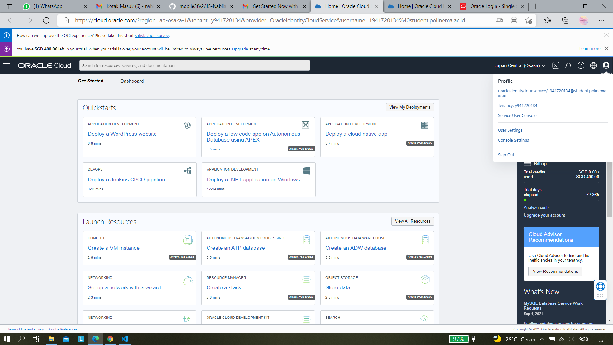

2. Buat instance melalui dir _Compute > Instance_

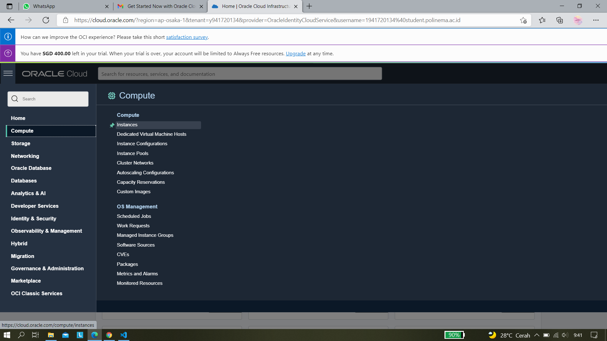

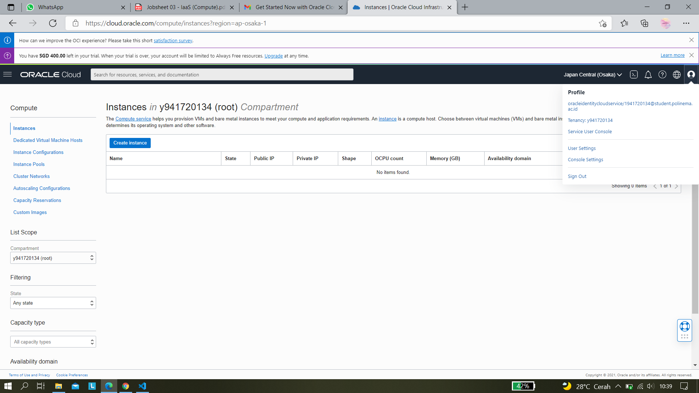

3. Penamaan compute instance

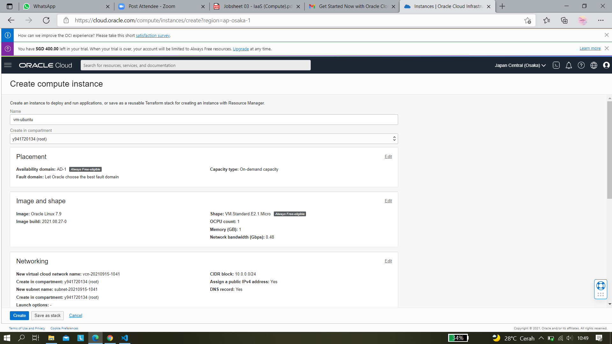

4. Setting komponen compute instance dan Image Shape 

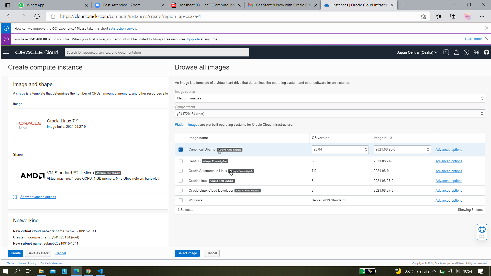

5. Mengunduh private key (SSH Key)

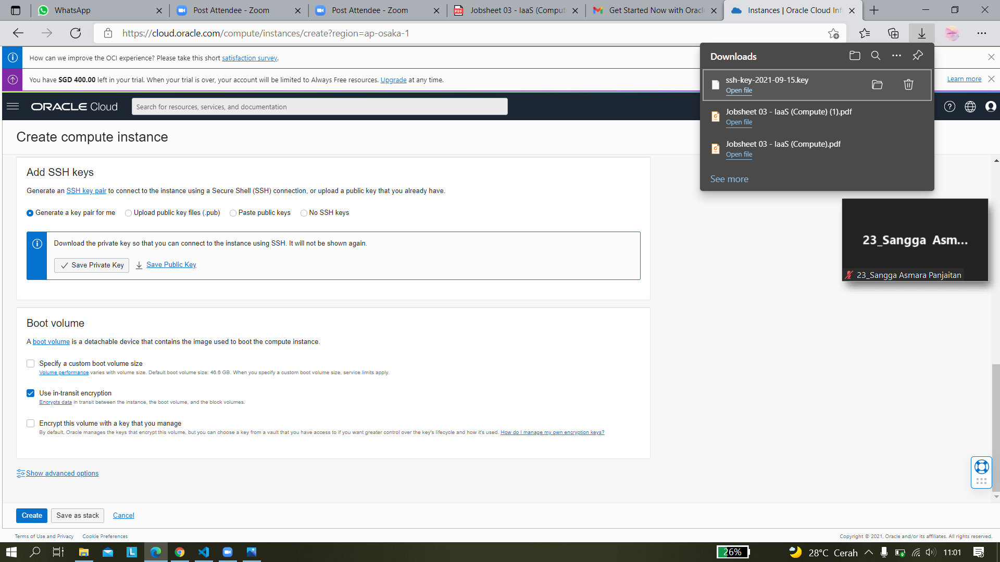

5. Instance berhasil dibuat

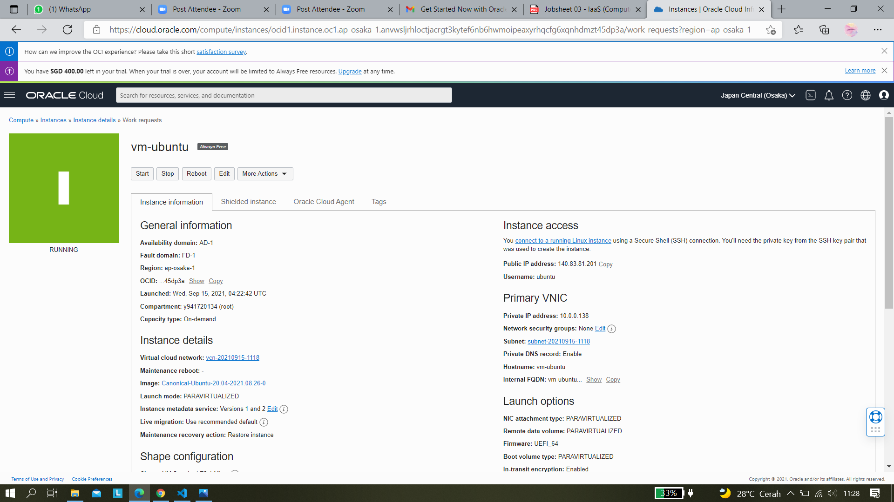

6. Menghubungkan SSH key ke VM, buka aplikasi PuTTY Key Generator

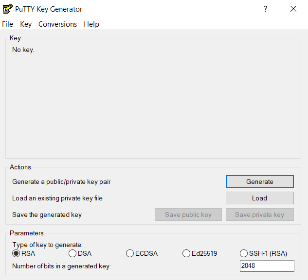

7. Mengkonversi SSH key dari oracle menjadi Private Key yang disupport oleh PuTTY

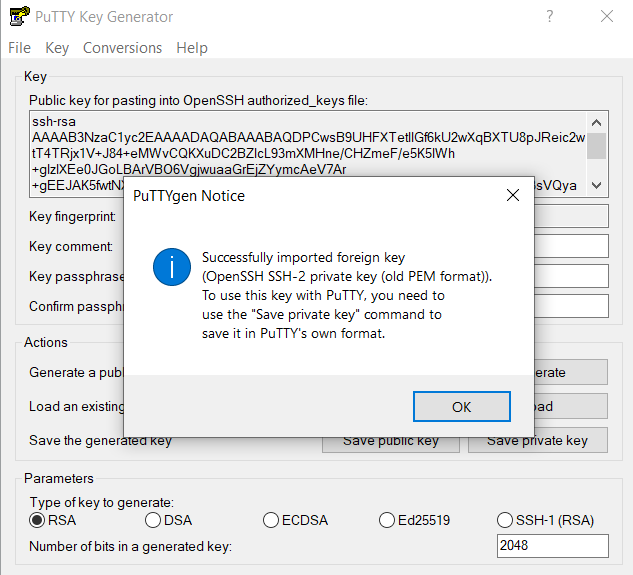

8. Save Private Key yang sudah dikonversi

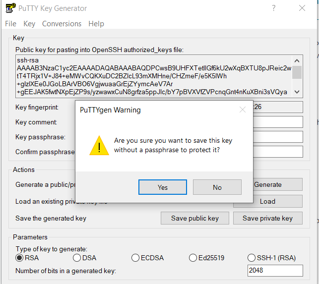

9. Buka aplikasi PuTTY, masukkan Host Nama dengan format hostname@publicIPAddress yang didapat dari oracle

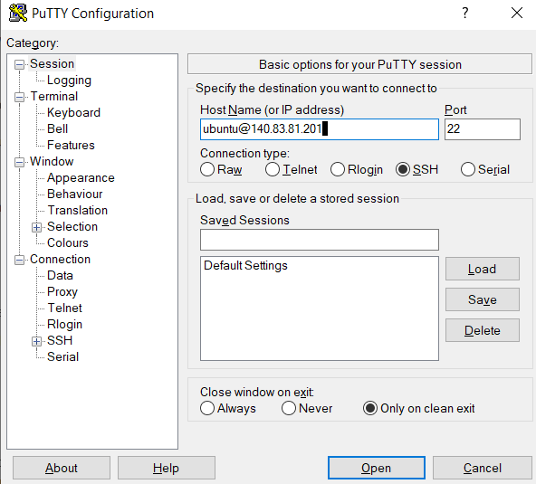

10. Expand tab Auth pada SSH, pilih file SSH Key pada kolom browse, lalu klik Open

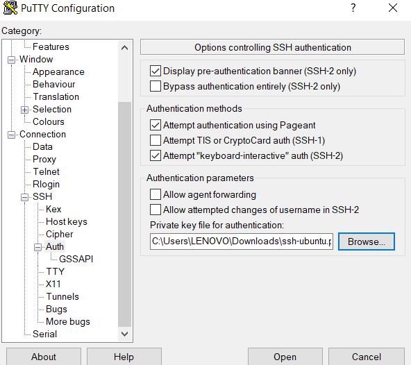

11. Setelah klik open akan muncul terminal yang menunjukkan hasil koneksi SSH Key yang ada di oracle

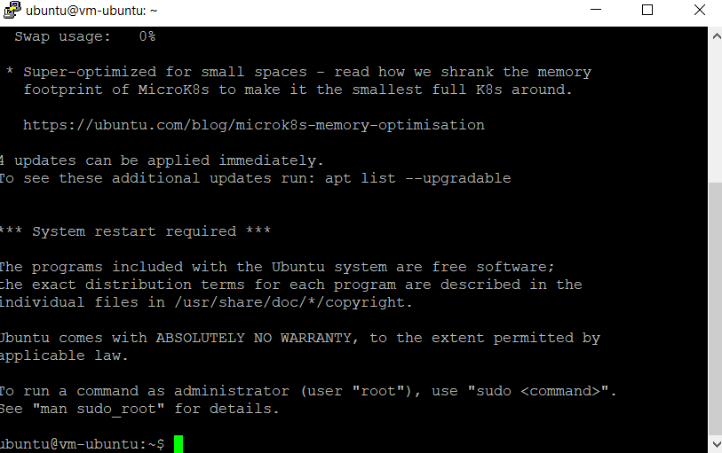

12. SSH Key berhasil terkoneksi.
