# 04 - Membuat Database dan mengkoneksikan dengan MySQL pada Oracle

## Tujuan Pembelajaran

1. Mengetahui cara membuat Database
2. Mampu mengkoneksikan MySQL

## Hasil Praktikum
Praktikum 1 | Membuat Database
1. Login ke akun Oracle CLoud

2. Setelah berhasil login dan ada di beranda Oracle Cloud akun, pilih menu di pojok kiri atas, lalu pilih menu Database > MySQL

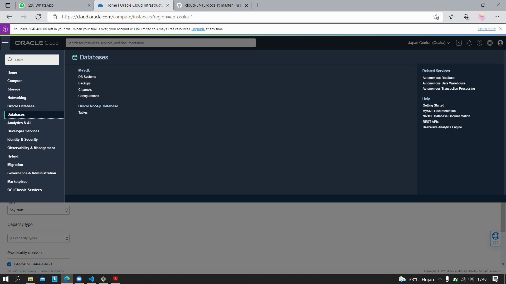

3. Create Admin Kredensial

4. Configure Network

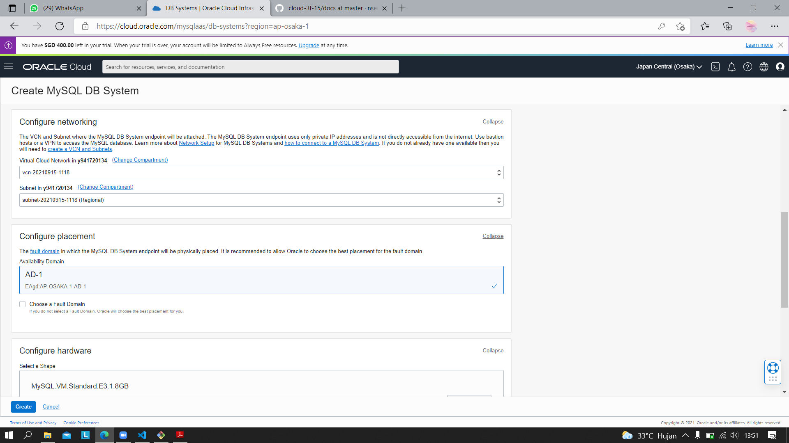

5. Configure Placement

6. Configure Hardware

7. Configure Backup Plan

8. Create Database

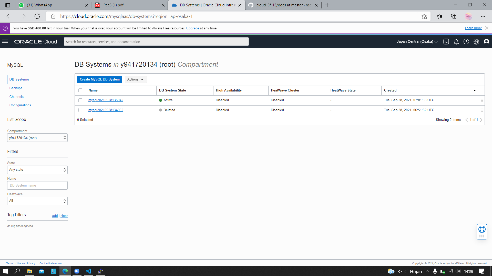

9. Cek Status Database, setelah database actived ikon akan berwarna hijau

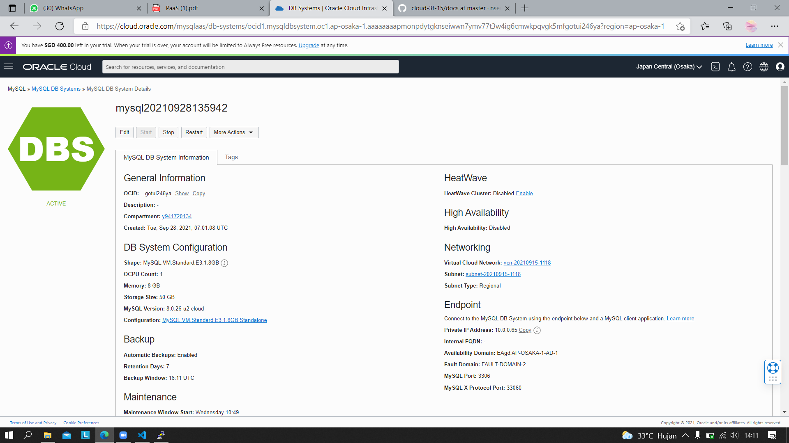

10. Mengaktifkan VCN yang telah dibuat pada tugas sebelumnya, ikon akan berwarna hijau

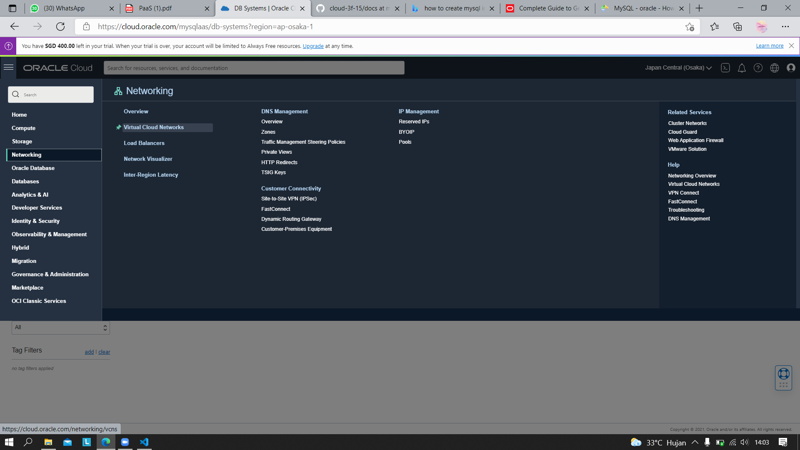
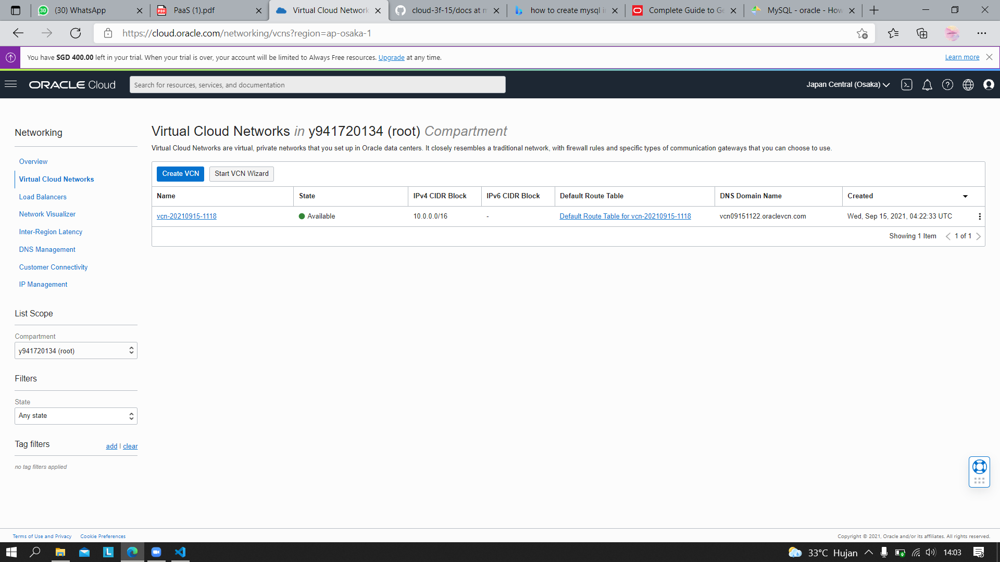
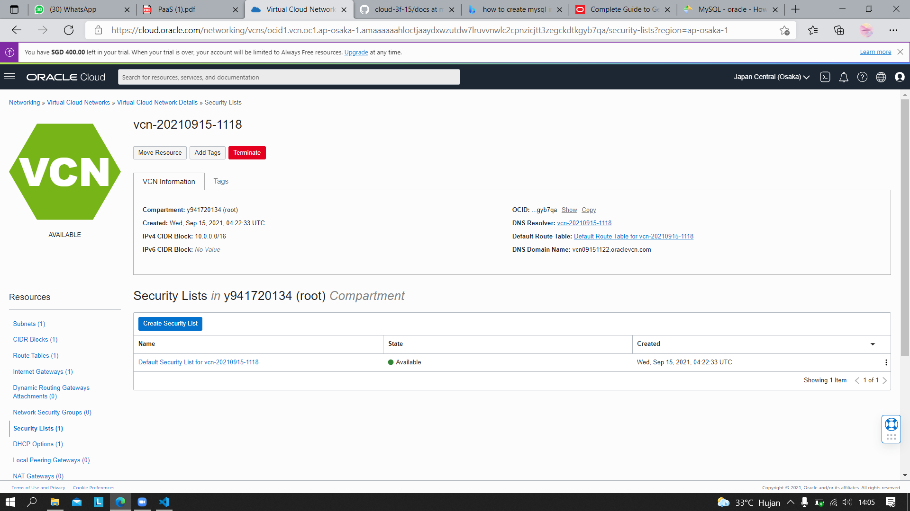

11. Mengaktifkan Security List

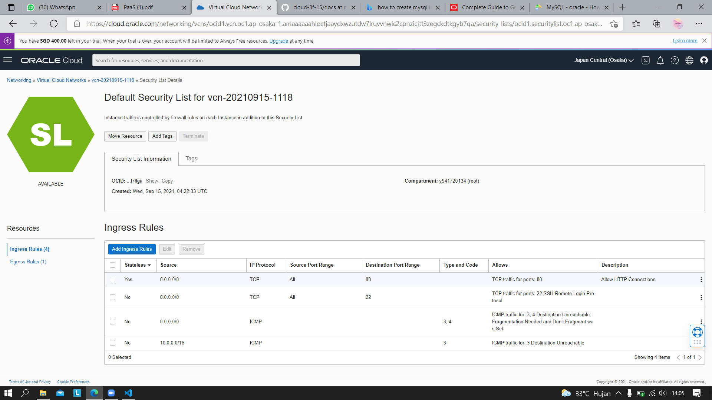

12. Configure Security List dengan menambahkan ingress rules sesuai dengan kriteria pada gambar

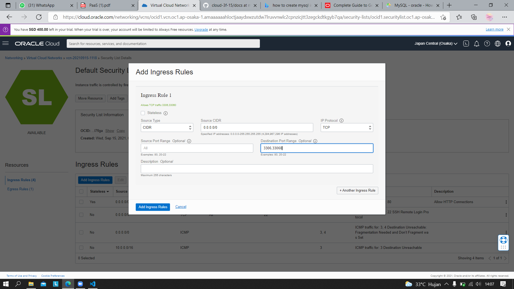

13. Hasil penambahan ingress rules

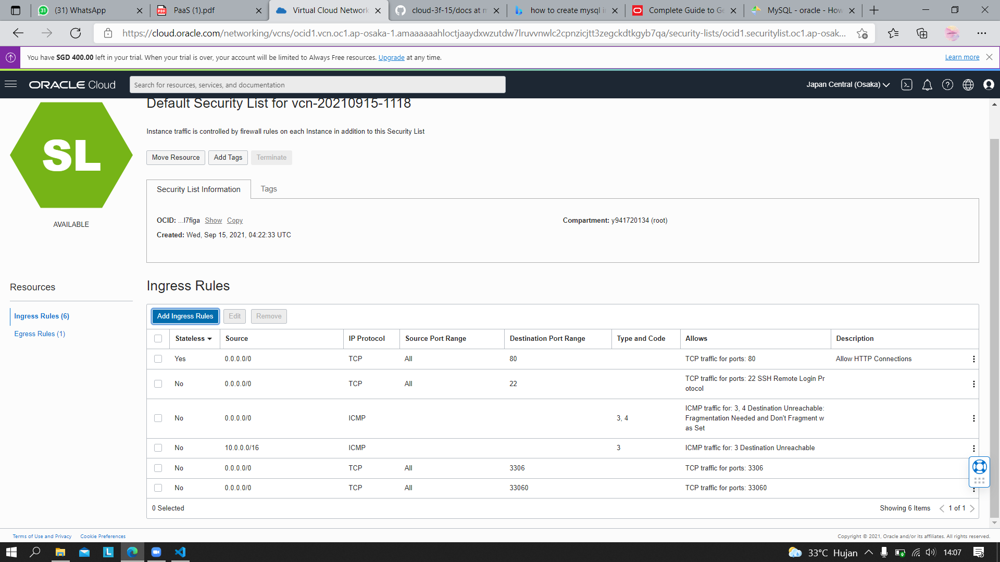

14. Mengkoneksikan MySQL ke VM yang telah kita buat, sebelum itu koneksikan menggunakan PuTTY

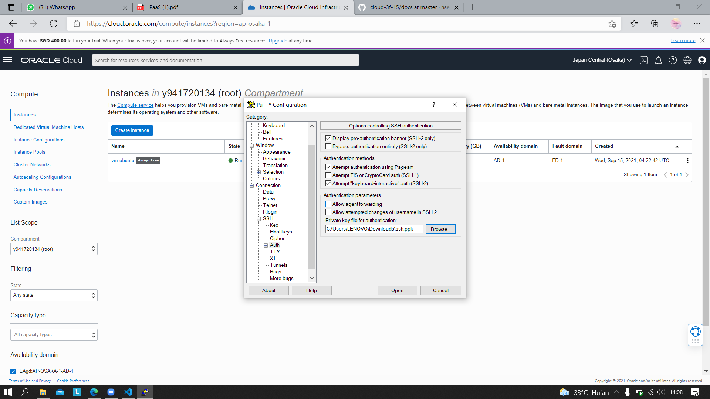

15. Masuk ke terminal ubuntu, koneksikan MySQL dengan ketik perintah mysql

16. Karena belum terkoneksi, maka install mysql client core 
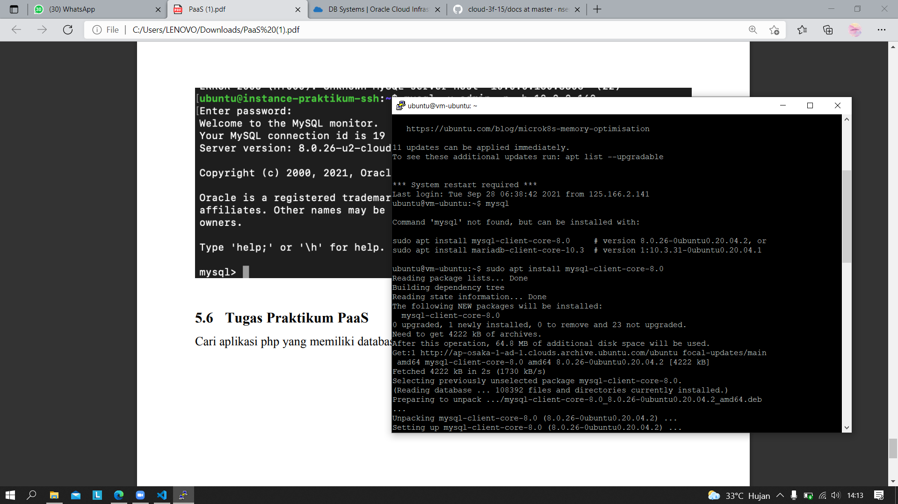

17. Install mariadb-client-core juga pada terminal

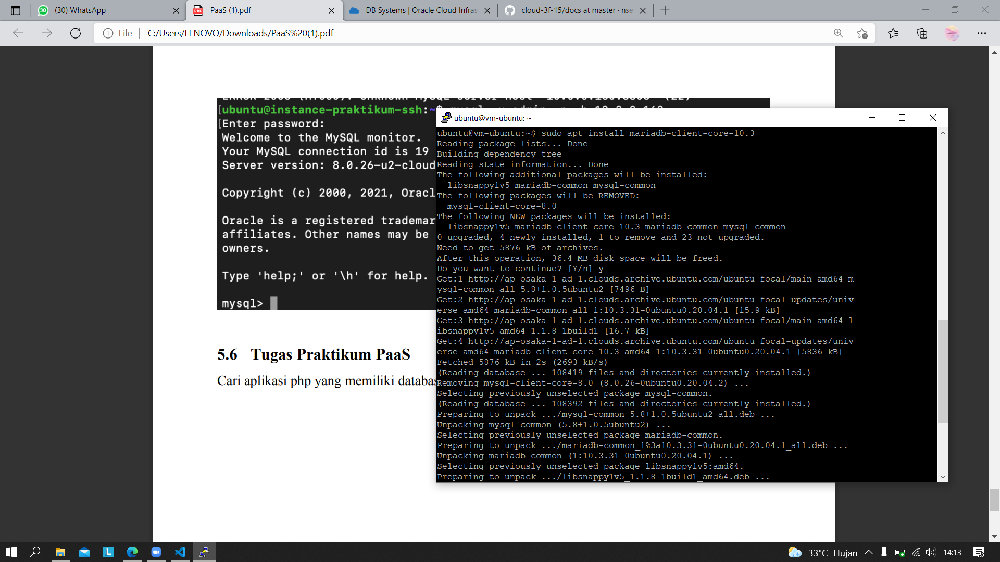

18. Koneksi MySQL telah berhasil
 
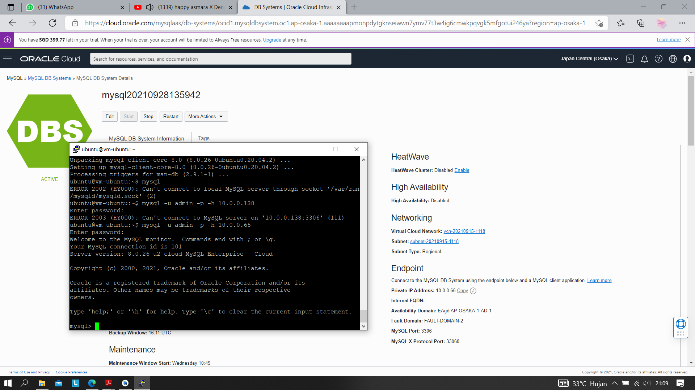

