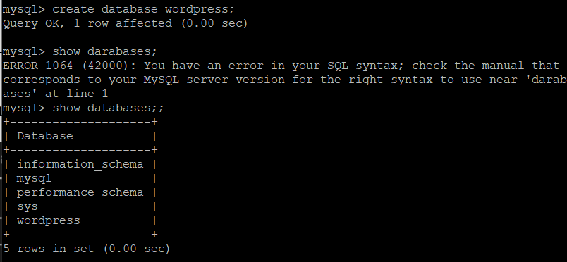
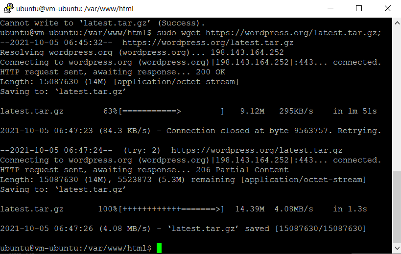
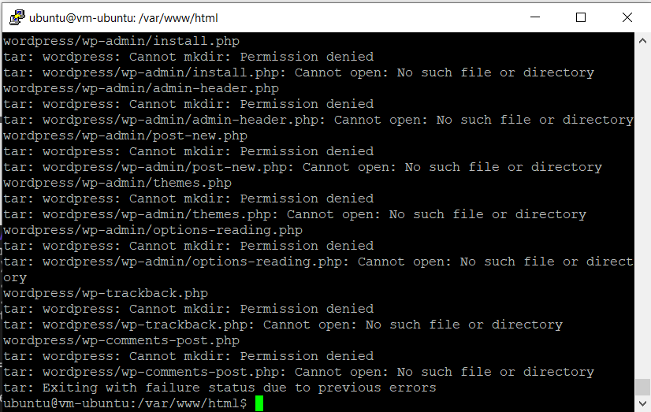
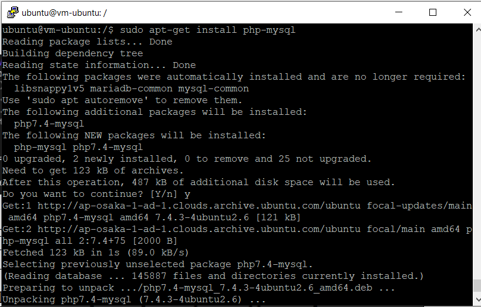

# 06 - Kuis 1

## Instalasi Wordpress pada PaaS

### Langkah-Langkah Instalasi
1. Membuat Database pada terminal VM dan masuk ke direktokri mysql kemudian ketikkan perintah "create database wordpress;"

2. Memberikan previleges database pada user admin dengan perintah "grant all privileges on wordpress.* to admin;"

3. Download Wordpress Pada Folder /var/www/html dengan perintah "sudo wget https://wordpress.org/latest.tar.gz";

4. Mengetrak Wordpress Pada Folder /var/www/html dengan perintah "tar zxvf latest.tar.gz"

5. Selanjutnya adalah installasi php mysql

