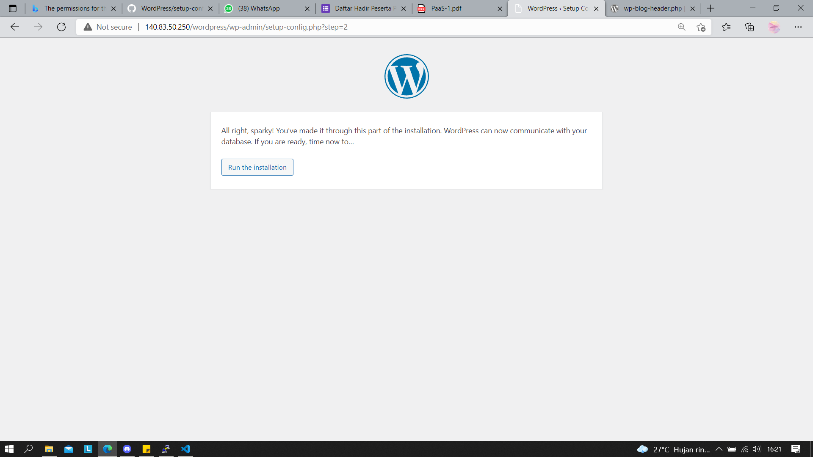

# 06 - Kuis 1

## Instalasi Wordpress pada PaaS

### Langkah-Langkah Instalasi
1. Membuat Database pada terminal VM dan masuk ke direktokri mysql kemudian ketikkan perintah "create database wordpress;"

2. Memberikan previleges database pada user admin dengan perintah "grant all privileges on wordpress.* to admin;"

3. Download Wordpress Pada Folder /var/www/html dengan perintah "sudo wget https://wordpress.org/latest.tar.gz";

4. Mengetrak Wordpress Pada Folder /var/www/html dengan perintah "tar zxvf latest.tar.gz"

ps: terdapat kesalahan teknis sehingga recreate instances, pada instances baru ulangi praktikum 1-4

5. Pada instances baru, langkah selanjutnya adalah instalasi php mysql

6. Membuat file phpinfo.php

7. Syntax phpinfo.php

8. Jalankan file php tsb untuk mengcek konfigurasi php

9. Setup config pada wordpress

10. Registrasi akun wordpress sebagai admin

11. Ready to install

12. Installation needed

13. Registrasi berhasil, login kembali!

14. Jika login berhasil maka akan menuju ke dashboard

