# 07 -  SaaS (Software as a Service)

## Tujuan Pembelajaran

1. Mengetahui layanan Oracle Cloud Infrasturcture Software as a Service.
2. Mampu mengguankan layanan software layanan oracle

## Hasil Praktikum
Praktikum 1 | Membuat Aplikasi 
1. Login OCI -> Pilih OCI Classic Service -> Create Instace
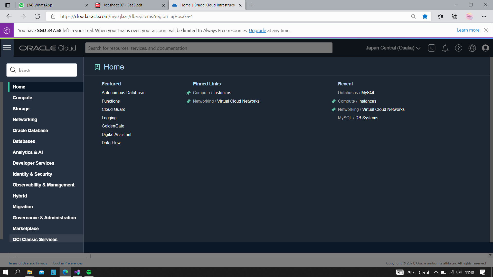

2. Pilih visual builder
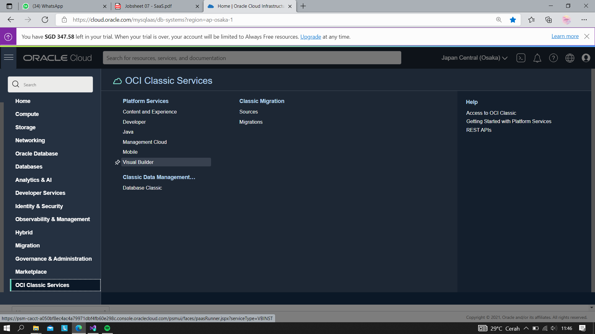

3. Buat instances
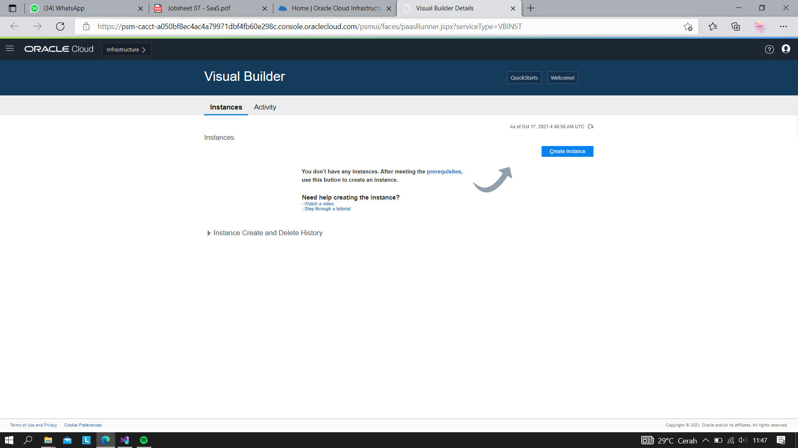

4. Isi nama instace, nama, deskripsi dari instance, Region dan tag
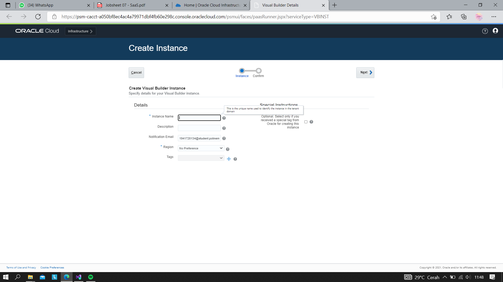

5. Hasil instance yang telah dibuat:
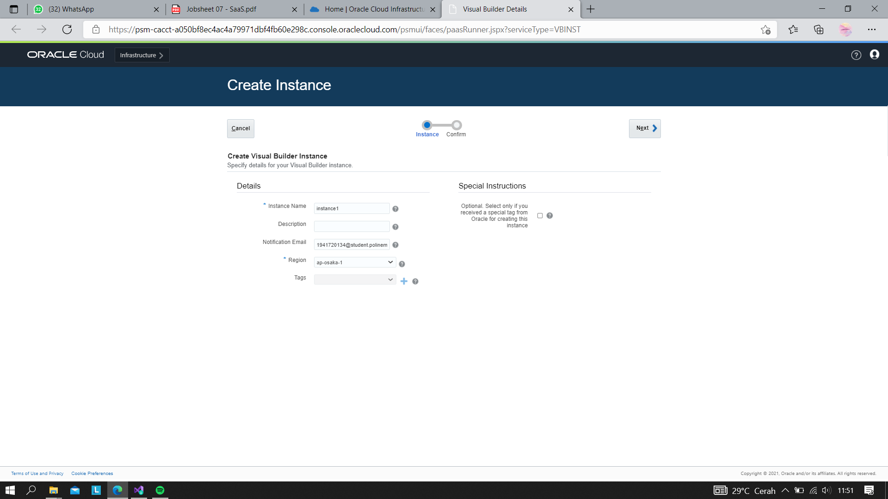
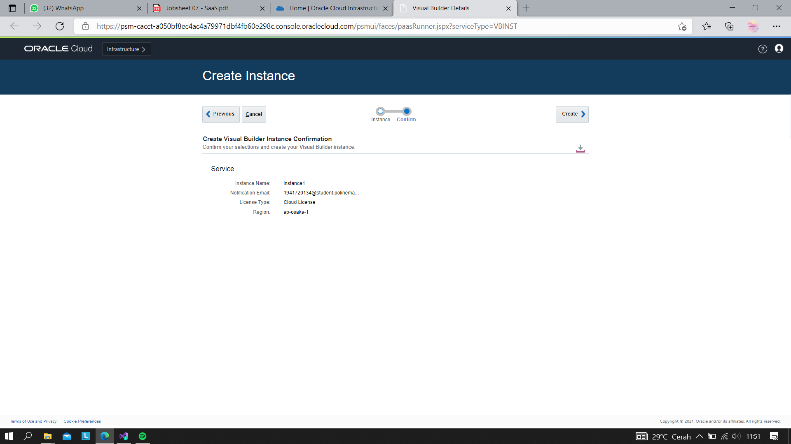
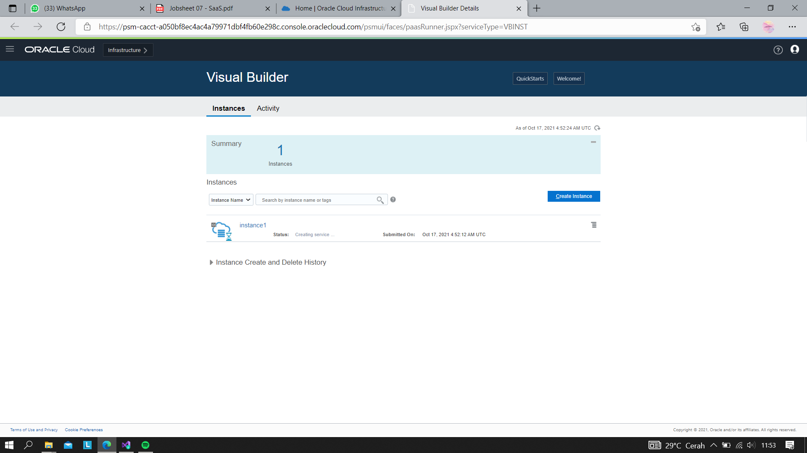
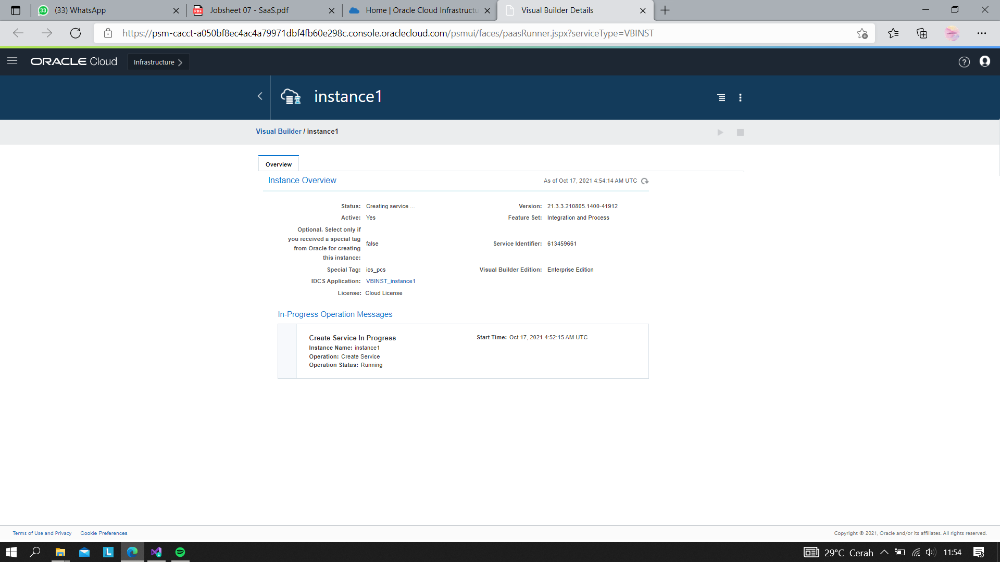

6. Lihat pada pojok kiri, terdapat simbol menu (klik simbol tersebut dan akan muncul menu beriku), kemudian pilih Open Visual Builder Home Page
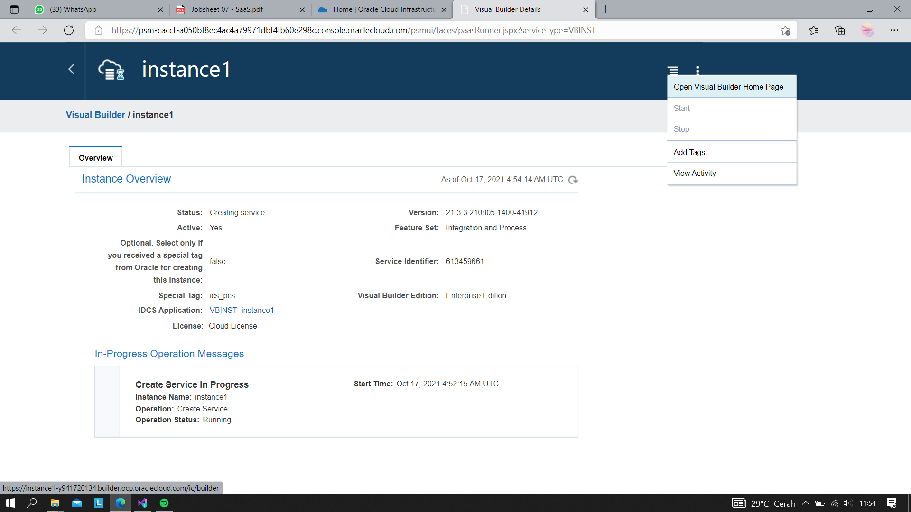

7. Tunggu beberapa saat, kemudian jika berhasil akan muncul halaman berikut. Klik New Application
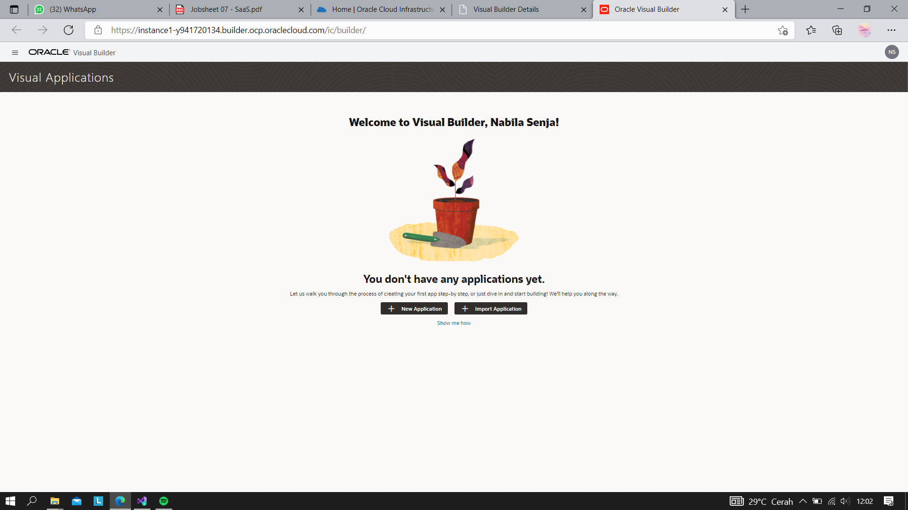
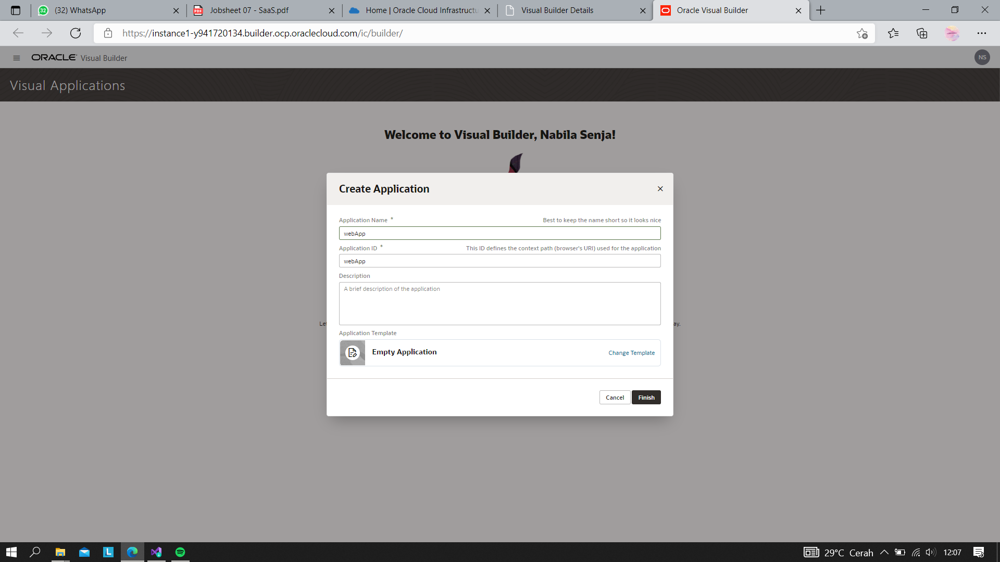

8. Jika kita berhasil membuat akan muncul nama aplikasi yang akan kita buat seperti gambar dibawah ini:
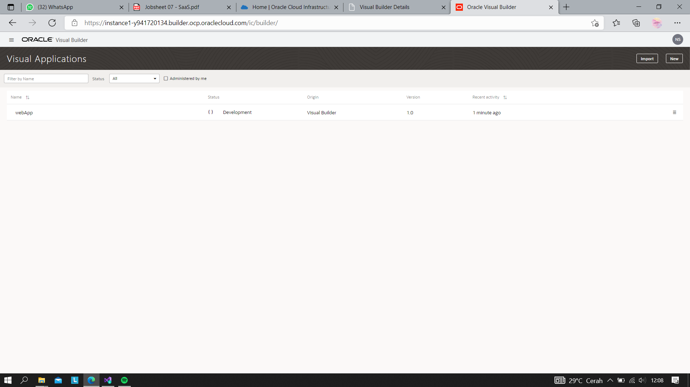

9. Klik nama aplikasi yang telah kita buat (seperti pada gambar sebelumnya), maka akan muncul halaman berikut
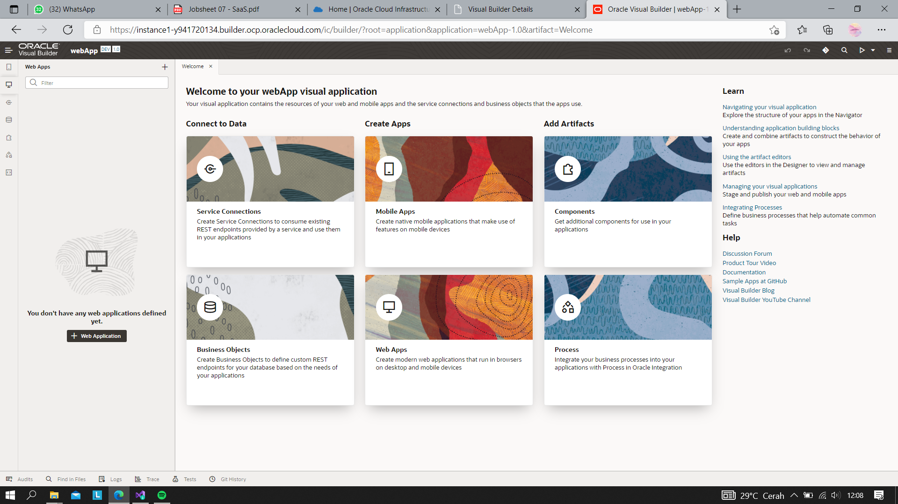

10. Pada sisi kiri adalah menu dari (kotak berwarna merah) visual builder dari aplikasi yang akan kita buat, pilih ikon web kemudian akan muncul menu berikut
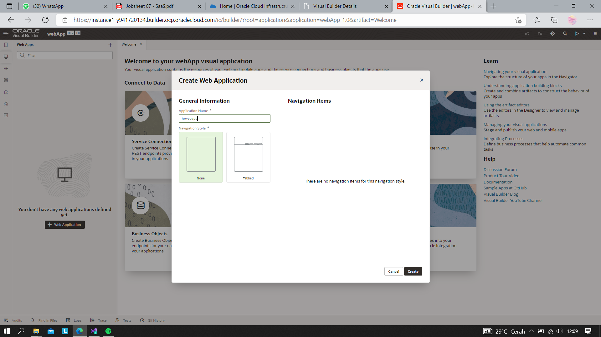
