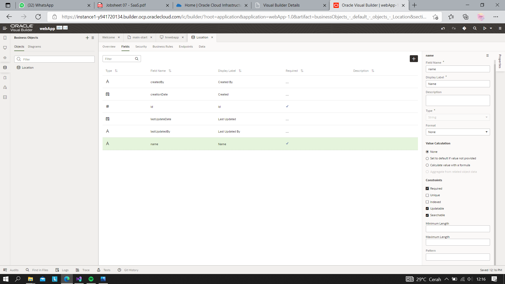
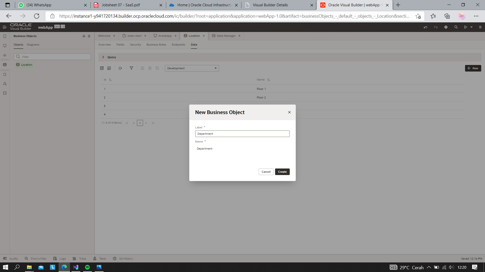

# 07 -  SaaS (Software as a Service)

## Tujuan Pembelajaran

1. Mengetahui layanan Oracle Cloud Infrasturcture Software as a Service.
2. Mampu mengguankan layanan software layanan oracle

## Hasil Praktikum
Praktikum 1 | Membuat Aplikasi 
1. Login OCI -> Pilih OCI Classic Service -> Create Instace

2. Pilih visual builder

3. Buat instances

4. Isi nama instace, nama, deskripsi dari instance, Region dan tag

5. Hasil instance yang telah dibuat:

6. Lihat pada pojok kiri, terdapat simbol menu (klik simbol tersebut dan akan muncul menu beriku), kemudian pilih Open Visual Builder Home Page

7. Tunggu beberapa saat, kemudian jika berhasil akan muncul halaman berikut. Klik New Application

8. Jika kita berhasil membuat akan muncul nama aplikasi yang akan kita buat seperti gambar dibawah ini:

9. Klik nama aplikasi yang telah kita buat (seperti pada gambar sebelumnya), maka akan muncul halaman berikut

10. Pada dialog box Create Application, isi nama web dengan nama “hrwebapp” dan untuk 
novigation style biarkan none

11. Expand hrwebapp, kita akan melihat struktur struktur dari aplikasi web, kurang lebih seperti gambar dibawah ini:

### Import Location Business dari file
Pada tahap ini kita akan membuat object busines location dan melakukan import data.
1. Klik Busines Object , pada tab navigator

2. Klik tombol + Busines Object.
3. Pada dialog box Busines Object, isi field label dengan “Location” kemudian tekan tombol create (pada field name akan otomatis terisi).

4. Klik Field tab

5. Klik + Field untuk menambahkan Busines Object

6. Ketika pup-up box, masukan :
    - Label: Name
    - Field Name: name (automatically populated)
    - Type: String String (selected by default)

7. Pada property instpector, centang Required di bawah label constrain.

8. Klik Menu icon dan pilih Data Manager (Data Manager bisa kita gunakan untuk mengimpor data dari berbagai sumber

9. Pilih Impor From File.
10. Di kotak dialog Impor Data, klik kotak impor, pilih Location.csv, dan klik Impor. Ketika impor berhasil, klik Tutup

11. Di panel Bisnis Object, klik Location, lalu klik tab Data untuk melihat Location

### Department Business Object
1. Pada panel Business Objects, klik tanda +, lalu pilih Business Object

2. Pada new Business Object dialog Box, Pada field label isi dengan “Department”.
3. Klik Fields tab kemudian klik + Field.
4. Pada pop-up box, masukan:
   - Label: Name
   - Field Name: name (automatically populated)
   - Type: String String icon (selected by default)
   - Click Create Field.
5. Pada property instpector, centang Required di bawah label constrain.

6. Klik Fields tab kemudian klik + Field
Label: Location
Field Name: location (automatically populated)
Type: Reference Reference icon
Referenced Business Object: Location
(Reference field seperti foreign key pada database table)
Display Field: Name (automatically populated)

### Employee Business Object
Pada langkah ini, kita akan membuat objek bisnis terakhir yang kita butuhkan, objek Karyawan, yang berisi nama karyawan dan data pengenal. Dalam hal ini, Karyawan memiliki bidang Referensi yang merujuk ke Departemen.
1. Pada panel Bisnis oject, klik tanda +, lalu pilih Bisnis Objek.
2. Pada new Business Object dialog Box, Pada field label isi dengan “Employee”.
3. Klik Fields tab kemudian klik + Field.
4. Pada pop-up box, masukan:
• Label: Name
• Field Name: name (automatically populated)
• Type: String String icon (selected by default)
Click Create Field.
5. Pada property instpector, centang Required di bawah label constrain.
6. Pilih + Fields, kemudian mauskan atau isi:
• Label: Department
• Field Name: department (automatically populated)
• Type: Reference Reference 
• Referenced Business Object: Department
• Display Field: Name (automatically populated)
Klik Create Field.

7. Pilih + Fields, kemudian mauskan atau isi:
• Label: Hire Date
• Field Name: hireDate (automatically populated)
• Type: Date Date 
Klik Create Field.

8. Pilih + Fields, kemudian mauskan atau isi:
Label: Email
Field Name: email (automatically populated)
Type: Email Email 
Klik Create Field, Di editor properti, Format diatur ke Email.

9. Klik tab Endpoints dan lihat API resource dan REST end point yang dibuat untuk Business Object
Empoyee. Perluas node Resource API untuk melihat URL untuk mengakses metadata dan data untuk objek bisnis.

10. Di panel Objek Bisnis Navigator, klik tab Diagram, lalu klik tombol + busines object diagram

11. Pada Create Business Object Diagram dialog box, isi field Diagram name dengan “HRDiagram”.

12. Pada properti inspector, pilih semua 

