# 08 - Object Storage

## Tujuan Pembelajaran

1. Mampu membuat sataic website kemudian menghostinya ke Oracle Object Storage. 
2. Mengathui bahswa OCI memiliki free tier, salah satunya adalah object storage yang bisa digunakan untuk 
menyimpan file dan berjalan pada protokol https.

## Hasil Praktikum

1. Membuat bucket untuk website. Sign-in ke OCI kemudian pilih Object Storage
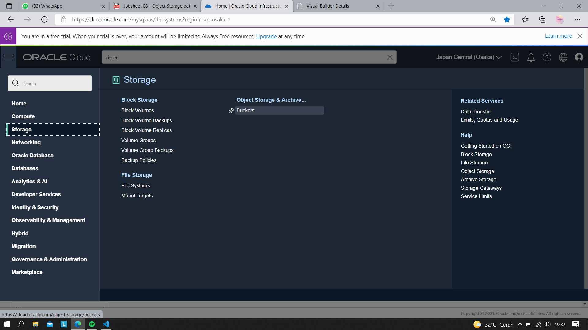
2. Create Bucket → Pilih standar bucket.
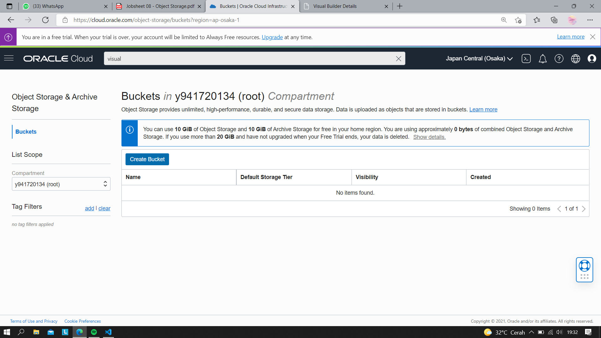
(Bucket Name → bebas)
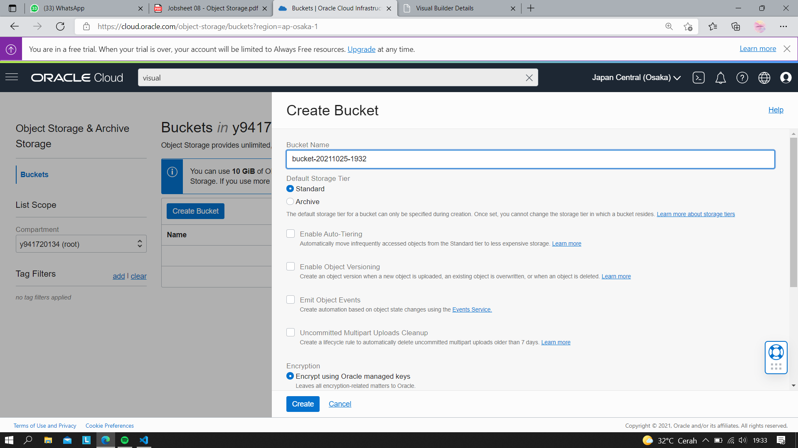
3. Brucket berhasil dibuat
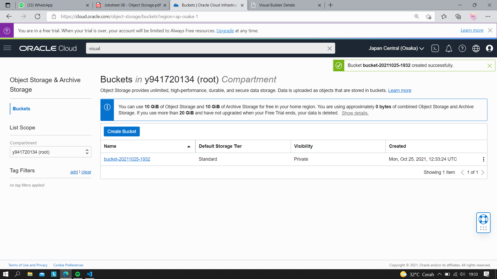
4. Buka bucket dengan melakukan klik pada nama bucket kemudian pilih Edit Visibility. Pilih Visibility menjadi Public. Tekan Save Changes untuk menyimpan perubahan.

5. Uploading web page. Pada bagian bawah dari Bucket Information terdapat box Object (upload semua file yang ada pada folder colorFliper)
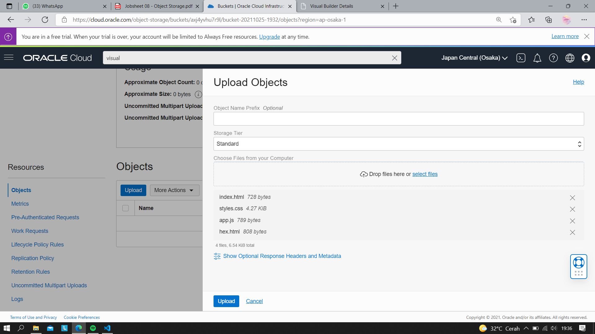
File berhasil diupload
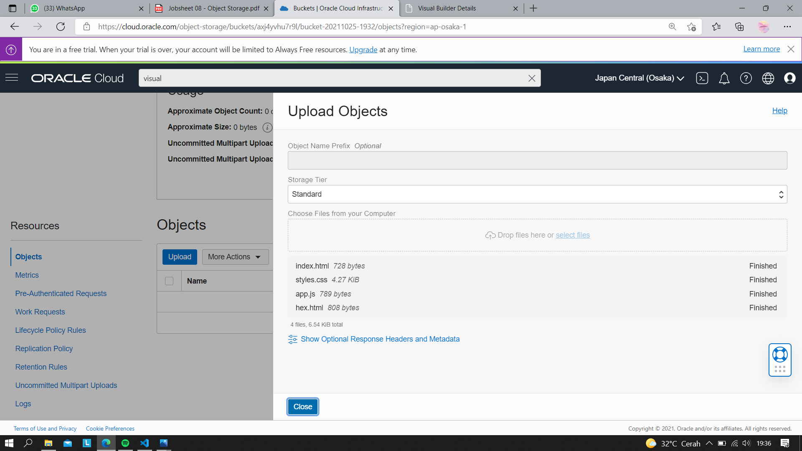
6. Setelah upload index.html file → Klik titik 3 pada sisi kiri file index.html.
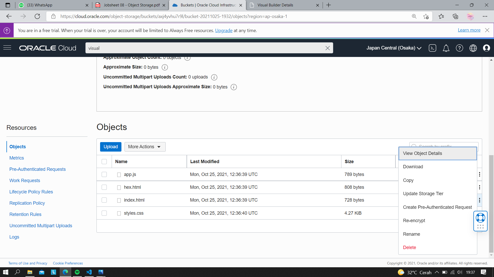
7. Kemudian pilih View Object Detail (Panel detail akan menunjukkan detail URL objek
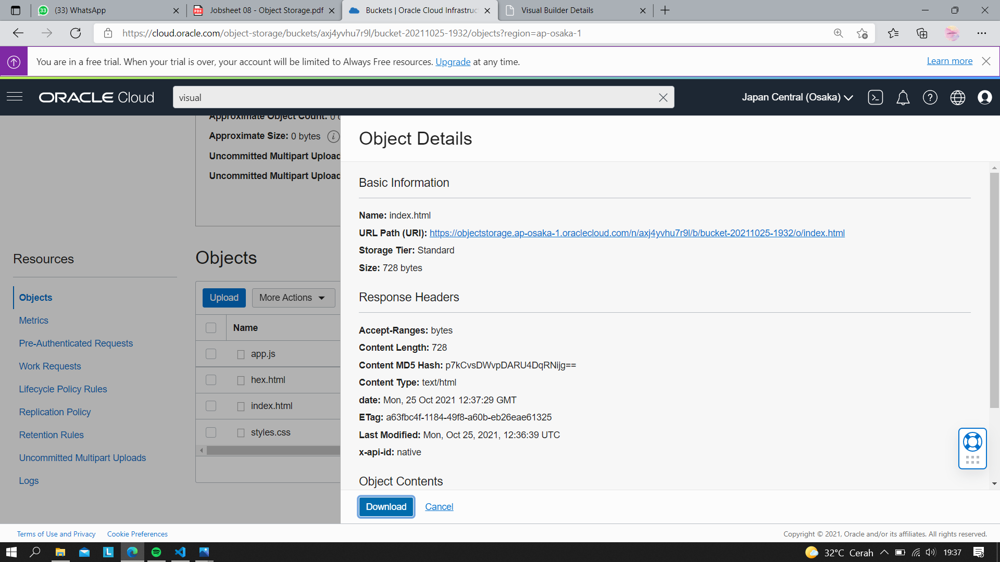
8. Kemudian pilih URL Path (URI) untuk membuka file , jika file yang di upload berhasil tampilan pada halaman akan seperti pada gambar di bawah ini
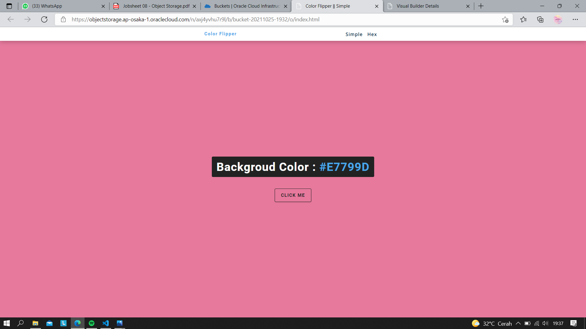

### Tugas Praktikum

1. Carilah aplikasi web static kemudian upload ke Object Storage yang telah Anda buat.

- Membuat bucket sesuai dengan langkah praktikum
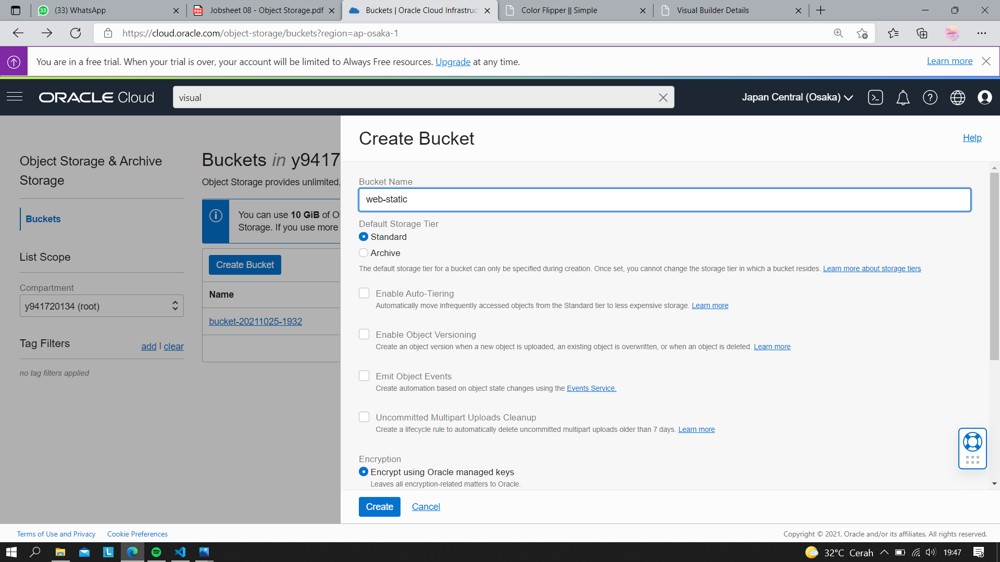
- Mengubah visibility menjadi public
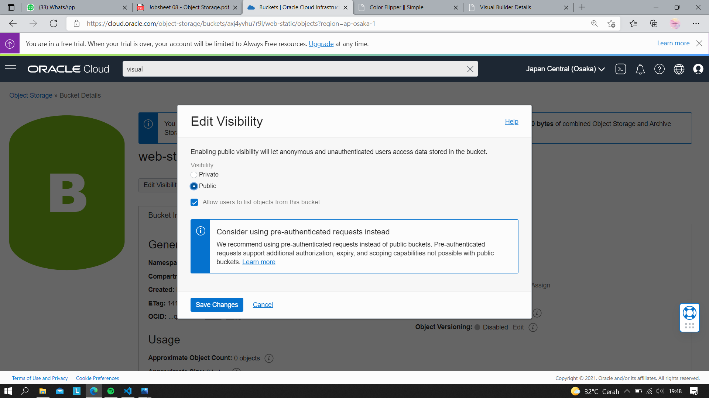
- Upload file object
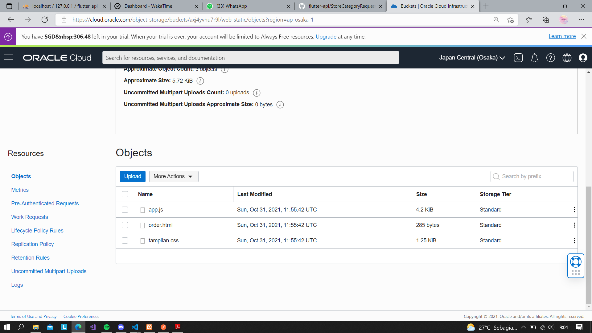

### Hasil project

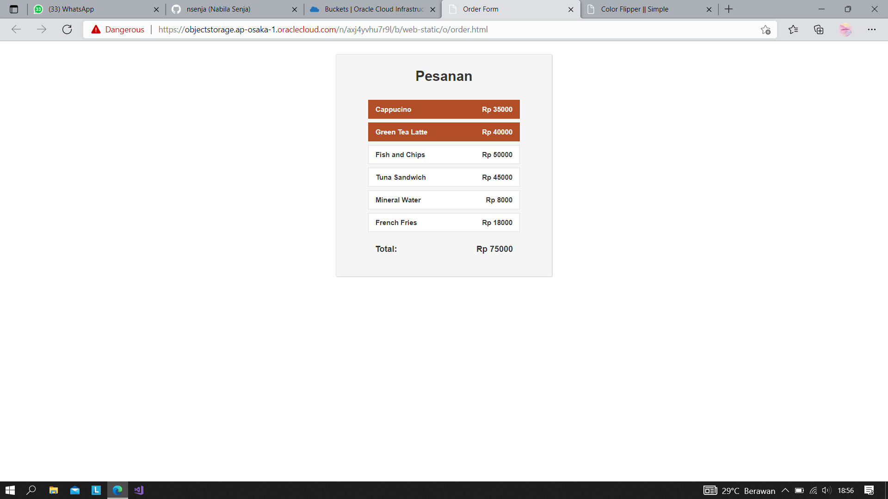
