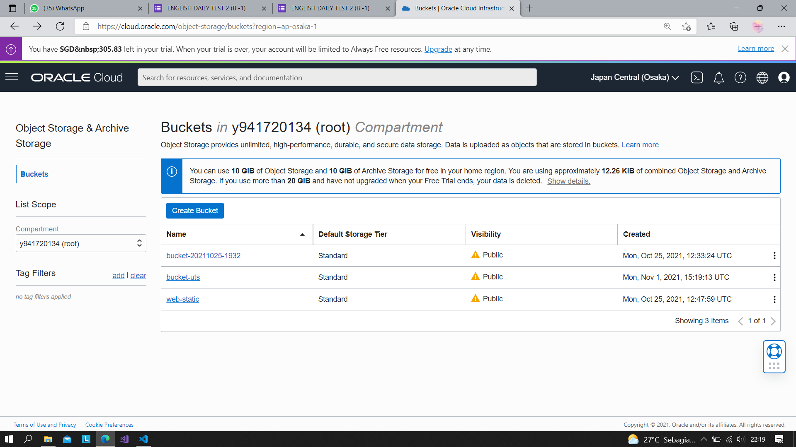
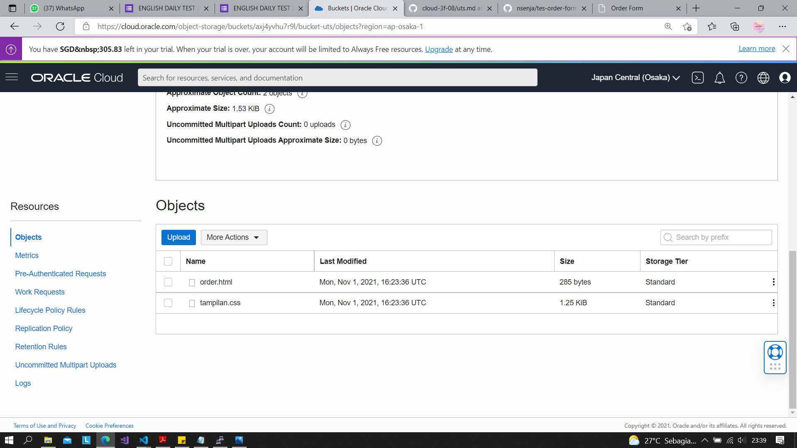
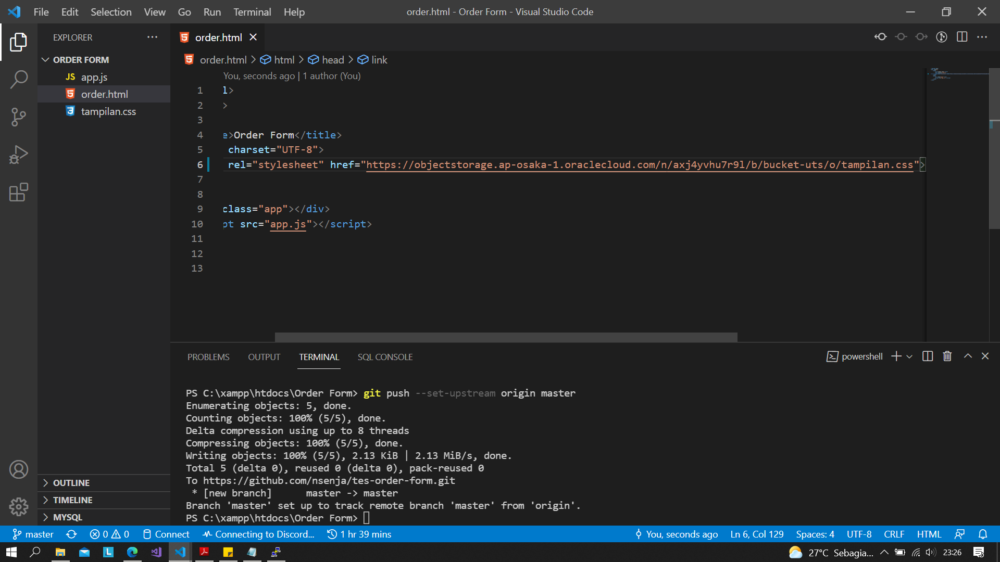
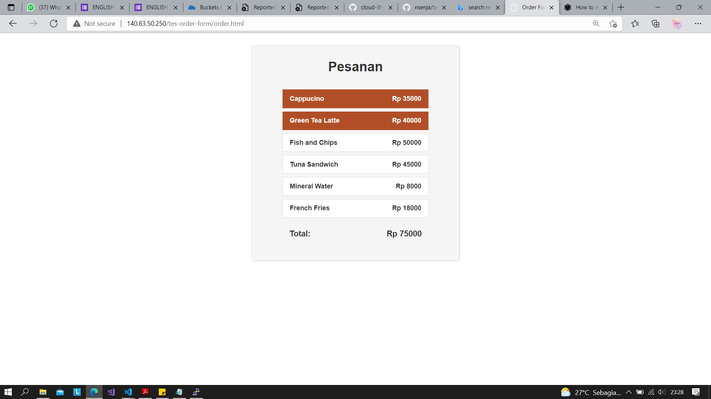

## Soal UTS
Silakan masing-masing individu memanfaatkan object storage sebagai media penyimpanan assets (gambar, file2 upload, dsb) berdasarkan project Kuis 1 kemarin yaitu aplikasi Wordpress.
Sehingga hasil akhir utk UTS aplikasi dpt memanfaatkan VM, DB instance dan Object Storage.

### Jawaban 
1. Gunakan VM pada praktikum sebelumnya
2. Sambungkan VM dengan SSH
3. Nyalakan database, tambahkan database 
.png)
.png)
4. Membuat bucket

5. Clone project
.png)
6. Upload file assets di object storage

7. ubah href assets sesuai dengan link object storage

8. Hasil 

1/11/2021
