# 10 - Docker

## Praktikum 1 - Instalasi Docker
1. Silakan masuk ke virtual mesin Anda kemudian jalankan perintah " sudo apt update && sudo apt upgrade "
2. Tunggu beberapa saat sampai proses update selesai, jika ada dialog yang menginfokan untuk dilakukan upgrade silakan dijawab dengan ‘y’.
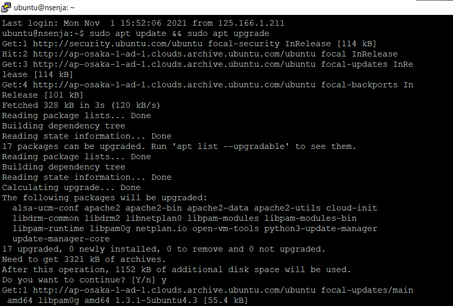
3. Install paket yang dibutuhkan sebelum melakukan instalasi docker, jalankan perintah "sudo apt-get install curl apt-transport-https \> ca-certificates software-properties-common"
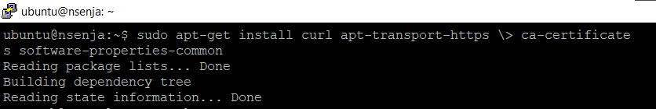
4. Langkah selanjutnya yaitu menambahkan repository docker, dengan perintah : " curl -fsSL https://download.docker.com/linux/ubuntu/gpg | sudo apt-key add - "
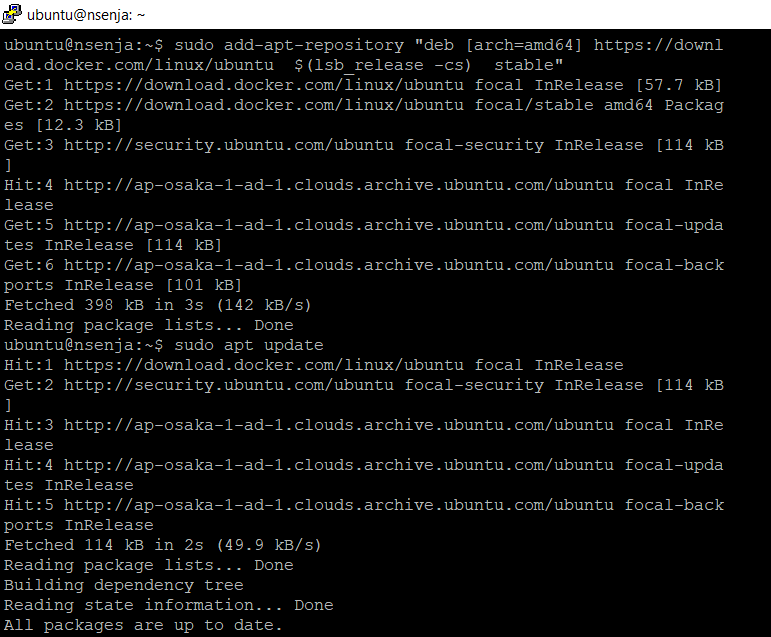
5. Lalu perintah " sudo add-apt-repository " deb [arch=amd64] https://download.docker.com/linux/ubuntu  $(lsb_release -cs)  stable" "
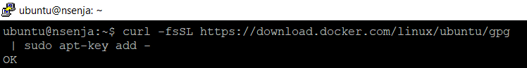
6. Perbarui dengan perintah " sudo apt update "
7. Cek docker dengan perintah " apt-cache policy docker-ce "
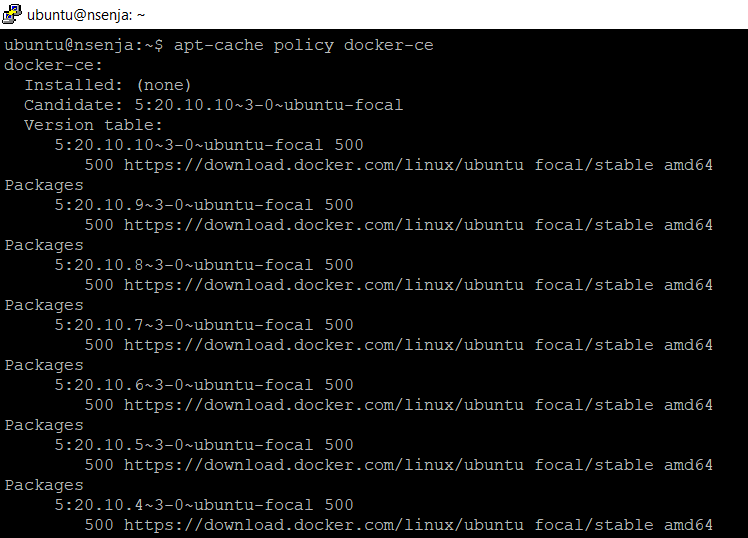
Jika kita lihat output dari perintah terakhir menandakan bahwa docker belum terinstall dan sudah ada di repository untuk siap dilakukan installasi.
8. Instalasi doker ketikkan perintah "sudo apt install docker-ce"
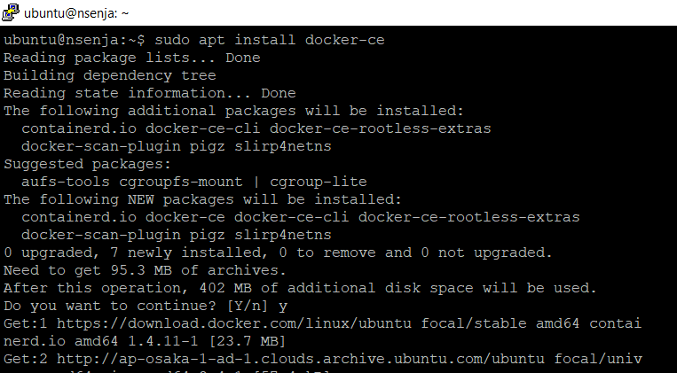
9. Ketika progress installasi sudah selesai, kemudian cek apakah docker daemon sudah jalan menggunakan perintah "sudo systemctl status docker". Jika menampilkan status active (running), berarti docker daemon sudah berjalan.
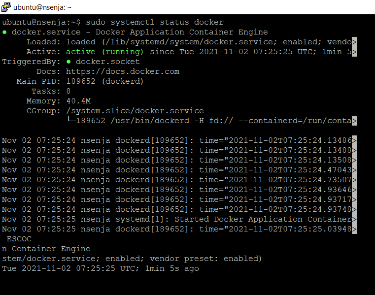
11. Untuk memastikan kembali, kita butuh menggunakan image test apakah docker benarbenar berjalan sebagaimana semestinya. Gunakan perintah "sudo docker run hello-world"
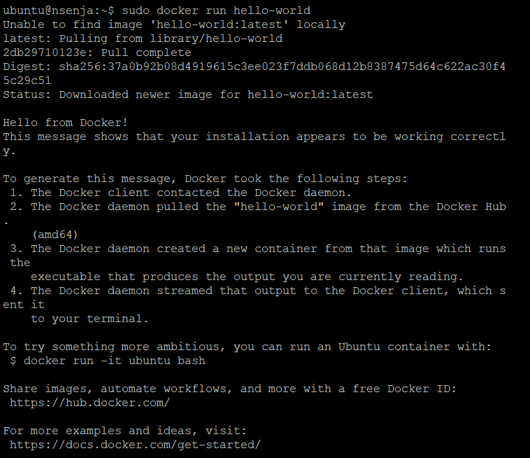
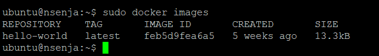

## Praktikum 2 - Membuat Container
1. Dengan docker, kita cukup satu baris perintah apache sudah bisa berjalan. Cek dengan perintah berikut
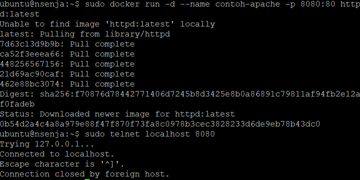

## Praktikum 3 - Membuat akun docker
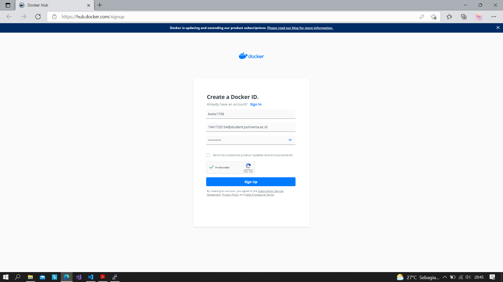
