# 11 - Docker 2

Tujuan Pembelajaran
1. Dapat mengetahui network pada Docker
2. Dapat mengetahui volume pada Docker
3. Dapat menggunakan volume dan network ketika build image Docker
4. Dapat menggunakan docker compose

## Hasil Praktikum
### Praktikum 1 - Docker Network

1. Membuat dan Memeriksa Docker Network
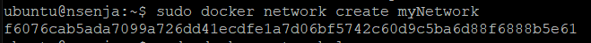
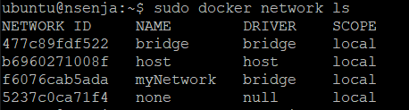

2. Mengetahui informasi detail dari network yang telah kita buat bisa menggunakan perintah inspect
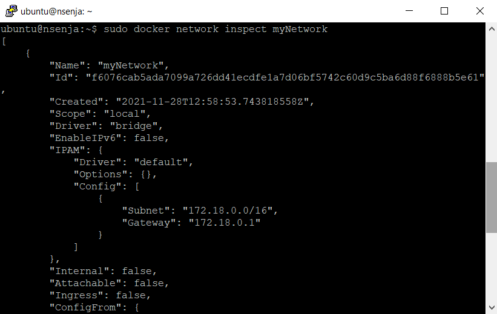

### Praktikum 2 - Menghubungkan Container ke Network
1. Buat terlebih dahulu contoh container, misalkan kita akan membuat container linux yaitu busybox.
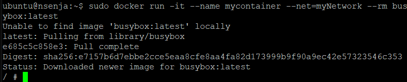
2. Buat container yang kedua menggunakan image linux alphine, buka terminal yang baru agar container1 tetap berjalan
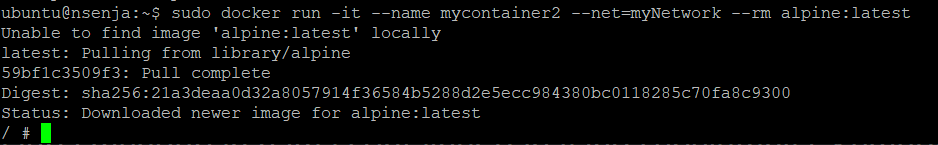
3. Kemudian cek masing-masing container tersebut menggunakan perintah ps untuk mengetahui status container yang sedang jalan. Buka terminal baru, jalankan perintah berikut
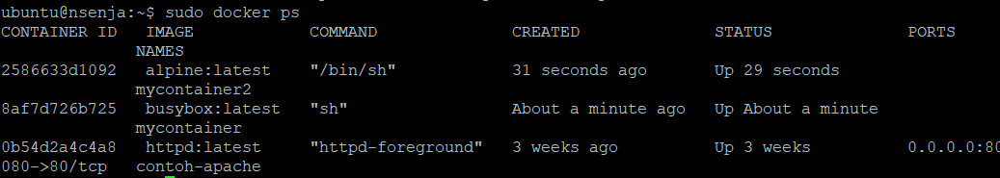
4. Kemudian jalankan inspect untuk mengetahui informasi detail dari masing-masing container.
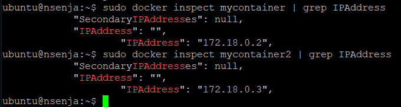
5. Untuk membuktikan silakan ping dari container1 ke container2, seharusnya akan reply.
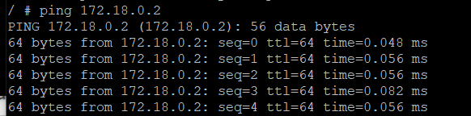
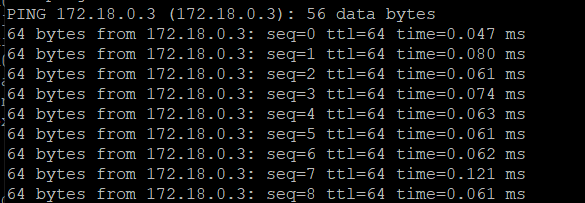

### Praktikum 3 - Membuka Port Container
1. Membuat image dari apache, layanan httpd. Bisa dilakukan dengan perintah di bawah ini
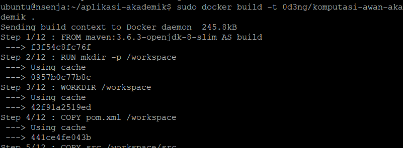
2. Silakan cek menggunakan telnet terhadap port yang di-expose, seharusnya akan menghasilkan output seperti berikut
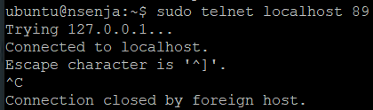
3. Kemudian untuk mengetahui port yang dilakukan expose pada container, bisa menggunakan perintah di bawah ini
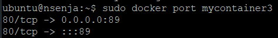

### Praktikum 4 - Docker Volume
1. Buat terlebih dahulu folder di host(laptop/computer/vps), misalkan saya buat folder docker-shared dan jangan lupa untuk masuk direktori volume, dan membuat file log.txt
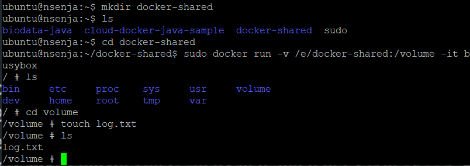
2. Selanjutnya membuat volume
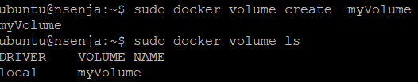

### Praktikum 5 - Docker Compose
1. Silakan masuk ke terminal VM, kemudian install docker compose dengan perintah sudo curl -L "https://github.com/docker/compose/releases/download/1.27.4/docker-compose-$(uname -s)-$(uname -m)" -o /usr/local/bin/docker-compose
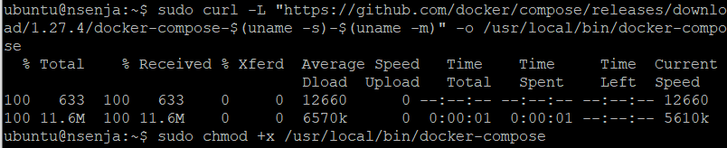
2. Cek versi docker compose untuk memastikan proses installasi berhasil dilakukan dengan perintah berikut dab clone repo yang telah disediakan menggunakan git atau download secara manual.
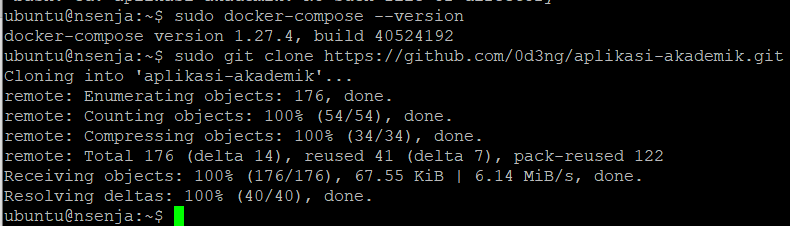
3. Build image tersebut menggunakan perintah build pada docker.

4. Selanjutnya buat folder data di bawah /opt agar data mysql tidak hilang ketika container dihapus dan jalankan docker compose menggunakan perintah berikut ini
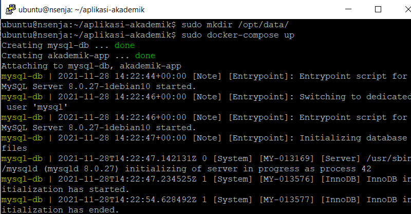
4. Untuk mengetahui container yang sedang berjalan menggunakan docker compose bisa dilakukan menggunakan cara sebagai berikut

