# 12 - CI/CD

Tujuan Pembelajaran
1. Dapat melakukan hosting static website menggunakan CI/CD Pipeline

## Hasil Praktikum
### Praktikum 1 - Menyiapkan Bucket Object Storage
1. Masuk ke akun https://cloud.oracle.com dan navigasi ke menu Storage -> Buckets
2. Tekan tombol Create Bucket, dan lengkapi Bucket Name dengan os-react. Biarkan nilai
lainnya dengan nilai default kemudian tekan tombol Create.

3. Ubah visibility bucket dengan menekan tombol Edit Visibility, dan ubah menjadi public.

4. Pada dashboard bucket, perhatikan nilai Namespace. Nilai ini nanti akan digunakan untuk
pengaturan deployment.

### Praktikum 2 - Menyiapkan project
1. Instal nodejs
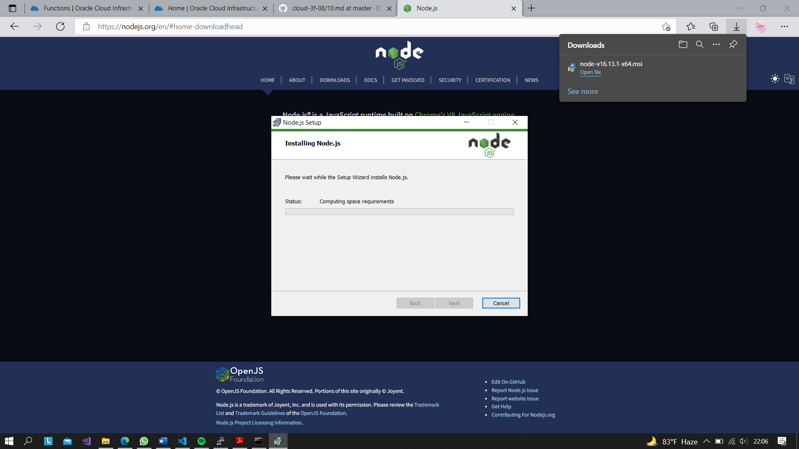
2. Setelah Node terinstall, silahkan lakukan Langkah generate project dengan menggunakan
perintah berikut. "npx create-react-app os-react"
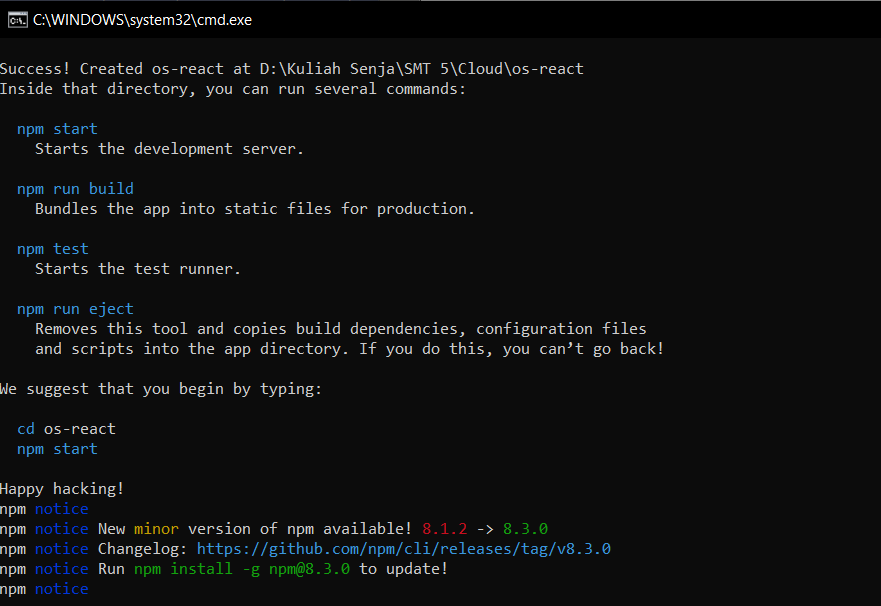
3. Buatlah repository pada GitHub kemudian push project tersebut ke dalam repository.
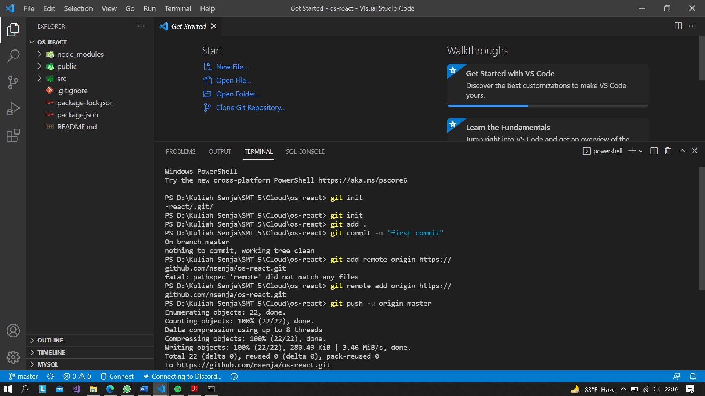
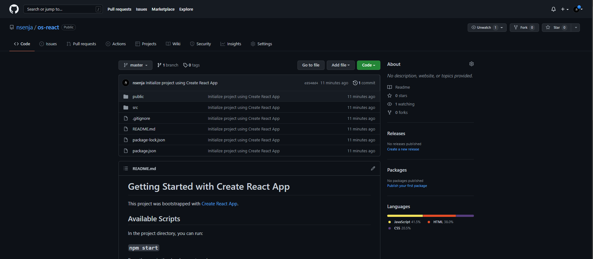

### Praktikum 3 - Membuat Github Workflow
1. Pipeline CI/CD pada GitHub dibuat dengan format yaml dan diletakkan pada lokasi
.github/workflows. Buatlah file yaml pada lokasi tersebut, sebagai ilustrasi silahkan
perhatikan filename berikut : .github/workflows/build.yml dan Salin konfigurasi pipeline
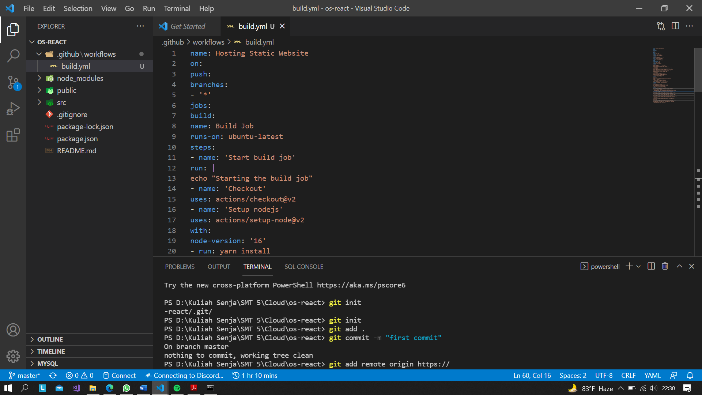
2. Pada pengaturan pipeline, terdapat nilai secrets yang diatur melalui pengaturan pada
repository GitHub.
3. Buka alamat repository GitHub, dan masuk ke menu Settings -> Secrets
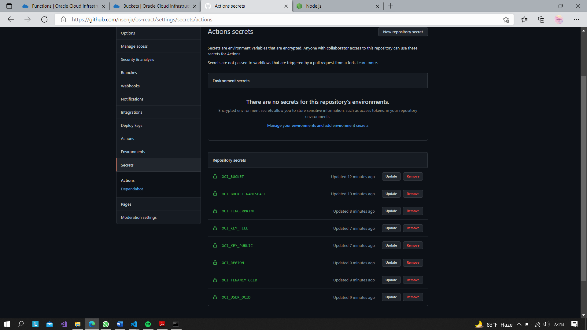
4. Jika proses deployment sudah mendapatkan tanda centang hijau, silahkan kembali ke dashboard bucket object storage. Centang berkas index.html, kemudian tekan menu titik
tiga dan pilih View Object Details. Perhatikan URL Path dengan pola sebagai berikut
https://objectstorage.<region>.oraclecloud.com/n/<namespace>/b/<bucketname>/
o/index.html.
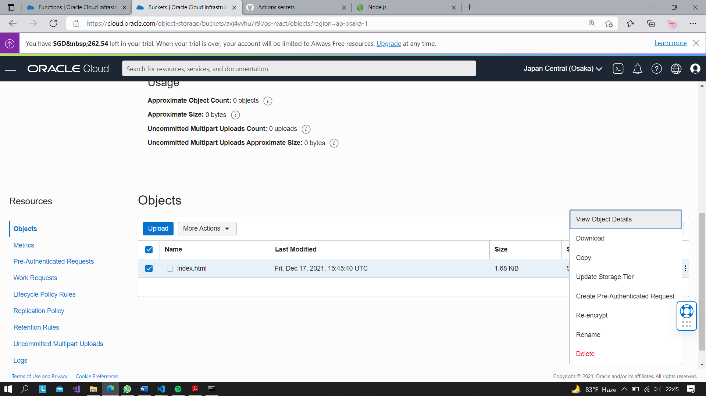
5. Salin URL Path tanpa nilai index.html, kemudian buka kembali project React. Cari berkas
package.json dan tambahkan key “homepage” dengan nilai URL Path pada Object
Details.
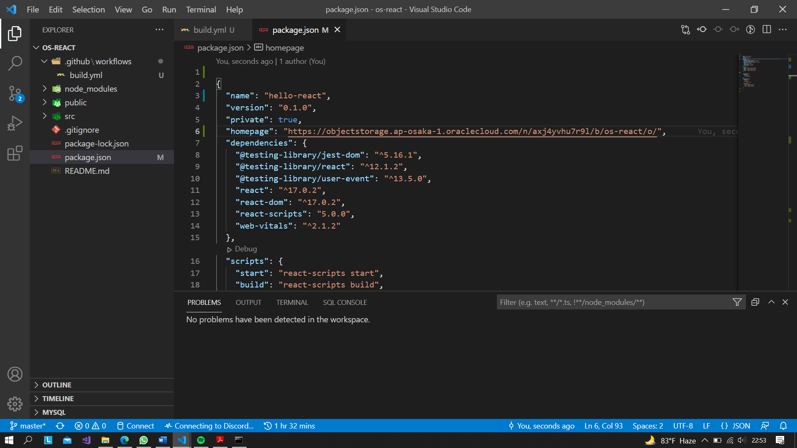

### Praktikum 4 - Deploy Simple Website Menggunakan Docker CI/CD Pipeline
Pada praktikum ini akan dilakukan proses deploy pada OCI Compute dengan menggunakan
docker. Pada Langkah di bawah mengasumsikan telah dibuat VCN dengan akses pada port HTTP
(80). Selain itu diasumsikan telah mempunyai akun docker hub.
### Menyiapkan Project Repository 
1. Dengan perintah npx create-react-app docker-react

2. Buatlah project baru pada GitHub, dan push project React tersebut
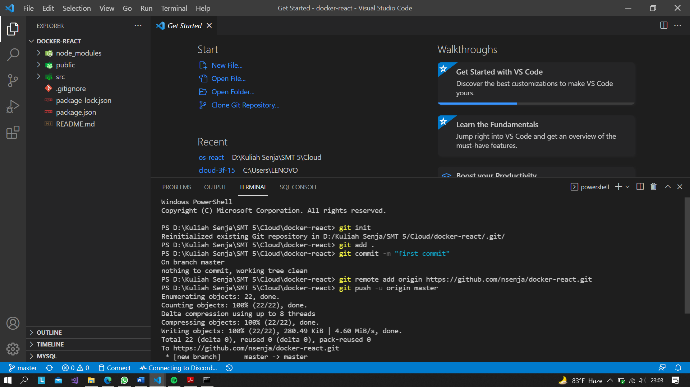

### Menyiapkan Akses Docker Hub
1. Silahkan login pada akun Docker pada https://hub.docker.com
2. Untuk memberikan akses push ke dalam registry, perlu dibuat Access Token. Silahkan masuk pada halaman https://hub.docker.com/settings/security kemudian tekan tombol
New Access Token.
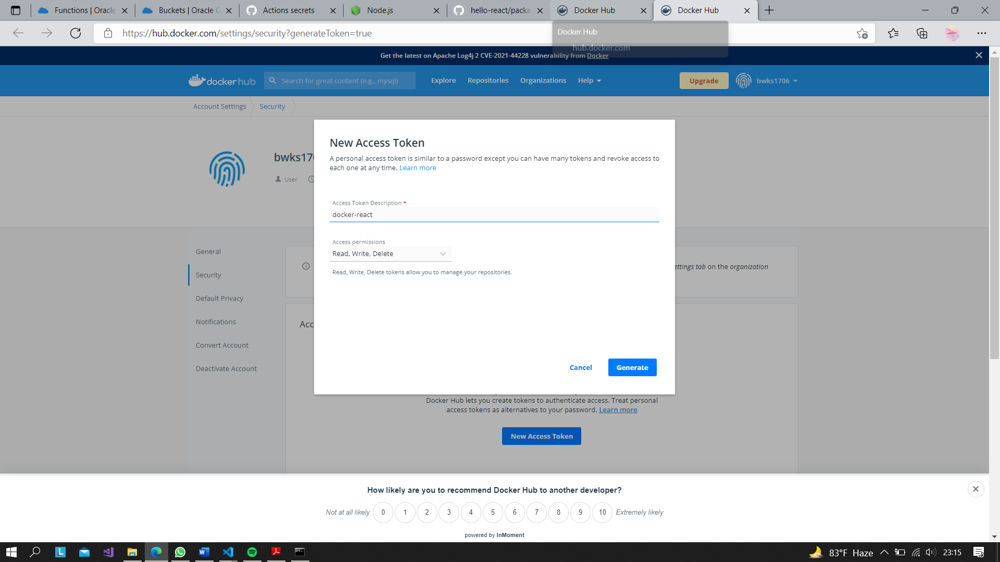
3. Masukkan GitHub Actions pada nama token, simpan nilai token yang telah didapatkan.
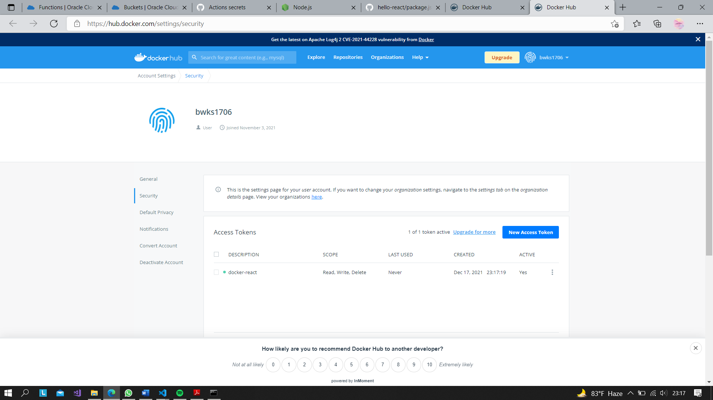

### Menambahkan GitHub Workflow
1. Buat sebuah file dengan berkas yaml, pada lokasi .github/workflows/deploy.yml.
2. Unduh konfigurasi berkas pada tautan https://github.com/dhanifudin/hello-reactdocker/
raw/master/.github/workflows/deploy.yml dan simpan pada lokasi tersebut.
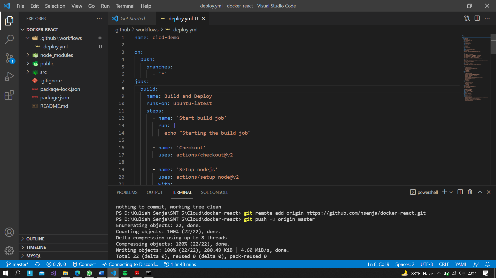
3. Tambahkan nilai-nilai secrets yang terdapat pada GitHub Workflow tersebut. Untuk nilai
yang diawali prefix OCI_ dapat digunakan table sebelumnya sebagai referensi.
4. Perhatikan table berikut sebagai referensi untuk pengisian nilai secrets
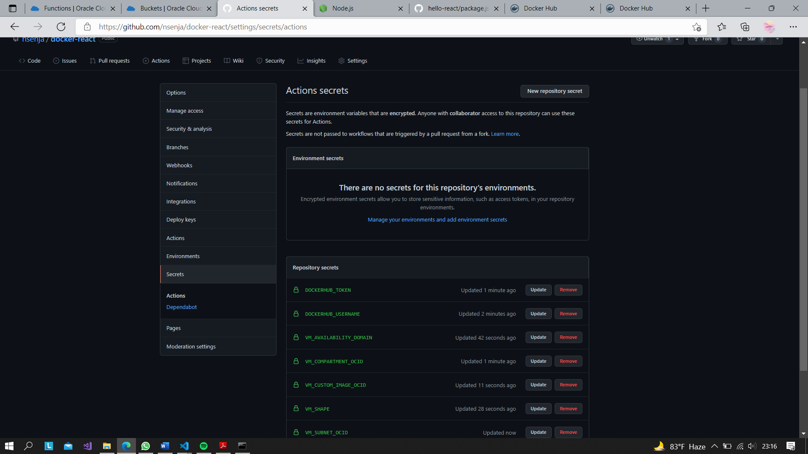

### Menyiapkan Dockerfile
1. Buatlah berkas dengan nama Dockerfile. Gunakan tautan berikut
https://github.com/dhanifudin/hello-react-docker/blob/master/Dockerfile sebagai template.
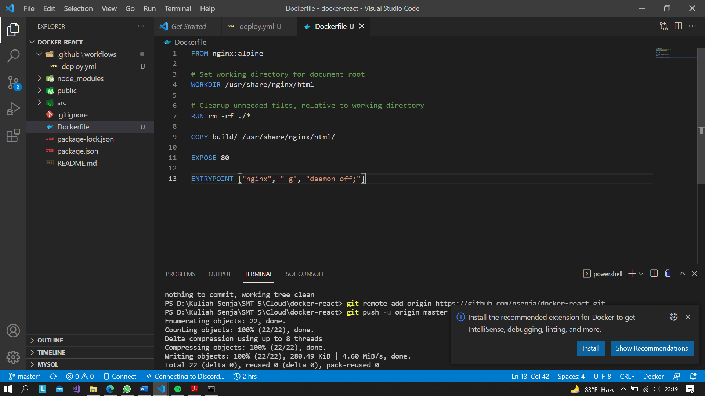
2. Pastikan penamaan berkas sudah sesuai.

### Menyiapkan Docker Compose
1. Buatlah berkas dengan nama docker-compose.yml
2. Gunakan tautan https://github.com/dhanifudin/hello-react-docker/blob/master/dockercompose.
yml sebagai referensi untuk membuat docker-compose.yml. Jangan lupa untuk
mengubah nilai image sesuai dengan username docker hub.
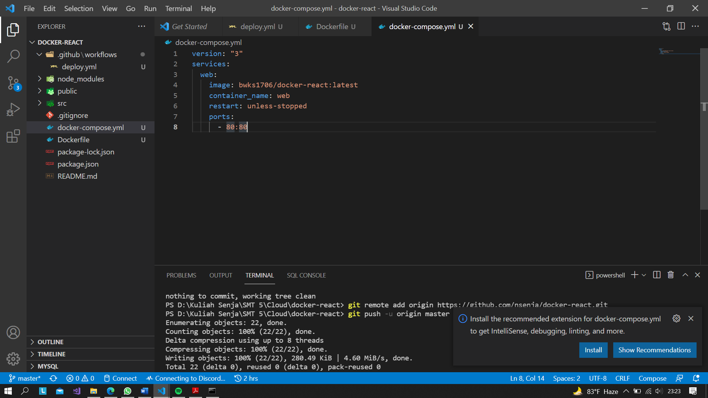

### Melakukan Deployment
1. Setelah berkas deployment dan nilai secrets telah selesai diatur, lakukan push ke
repository.
2. Amati log deployment pada tab Actions, dan pastikan proses menghasilkan tanda centang
hijau. Jika terjadi error, periksa kembali konfigurasi dan nilai secrets yang dimasukkan.
3. Setelah proses deployment berhasil, untuk mendapatkan nilai IP public yang dapat
diakses silahkan masuk ke dashboard pada halaman Compute Instances.
4. Pada hasil akhir, jika tidak terdapat kesalahan akan didapatkan halaman website seperti
pada gambar berikut