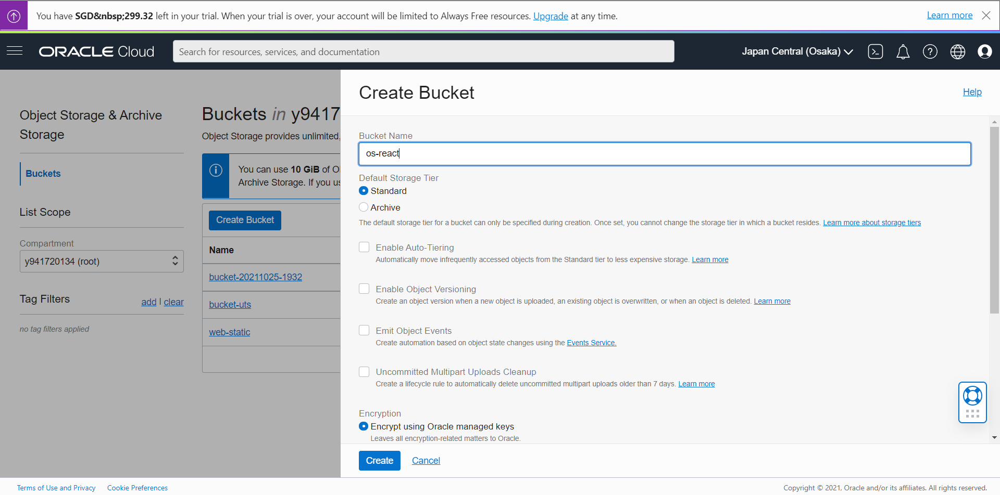
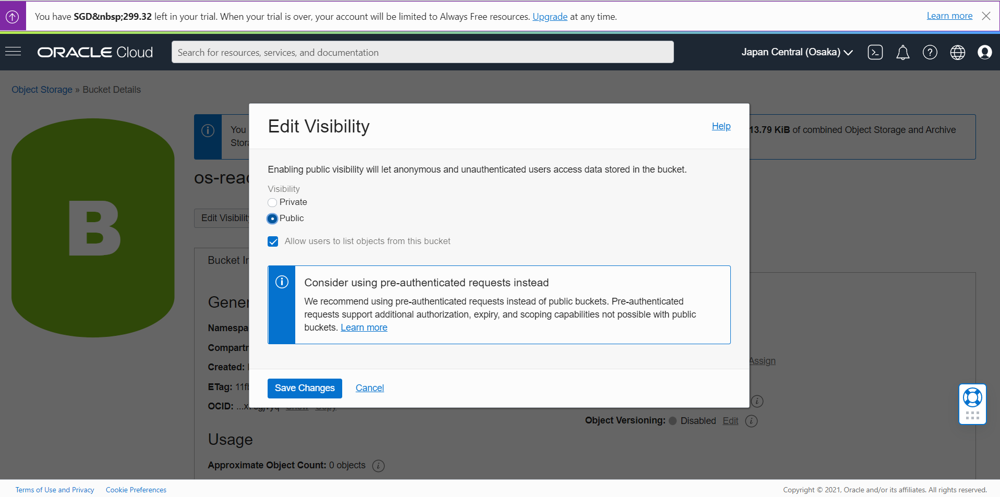
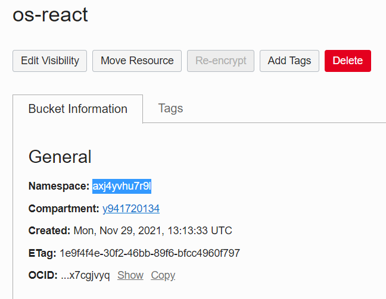
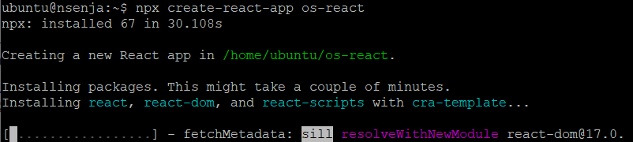

# 12 - CI/CD

Tujuan Pembelajaran
1. Dapat melakukan hosting static website menggunakan CI/CD Pipeline

## Hasil Praktikum
### Langkah 1 - Menyiapkan Bucket Object Storage
1. Masuk ke akun https://cloud.oracle.com dan navigasi ke menu Storage -> Buckets
2. Tekan tombol Create Bucket, dan lengkapi Bucket Name dengan os-react. Biarkan nilai
lainnya dengan nilai default kemudian tekan tombol Create.

3. Ubah visibility bucket dengan menekan tombol Edit Visibility, dan ubah menjadi public.

4. Pada dashboard bucket, perhatikan nilai Namespace. Nilai ini nanti akan digunakan untuk
pengaturan deployment.

### Langkah 2 - Menyiapkan project
1. Instal nodejs
2. Setelah Node terinstall, silahkan lakukan Langkah generate project dengan menggunakan
perintah berikut.

