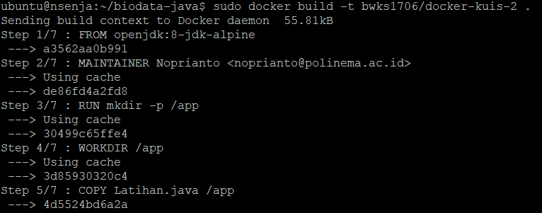

# 13 - Kuis 2

### Langkah-Langkah
1. Melakukan clone project yang akan di push ke docker hub.
link project : https://github.com/nsenja/biodata-java.git
2. Masuk ke dir project dan membuat build image pada docker

3. Login ke akun docker hub 

4. Lakukan push project ke dalam docker hub

5. Cek repository dpcker hub apakah sudah terpush/belum

