# 14 - Serverless

Tujuan Pembelajaran
1. Dapat mengetahui pengenalan terkait Serverless (Faas) - Function as a Service.

## Hasil Praktikun
### Praktikun 1 - Membuat Application dan Function

1. Masuk ke akun https://cloud.oracle.com dan navigasi ke menu Developer Services -> Applications
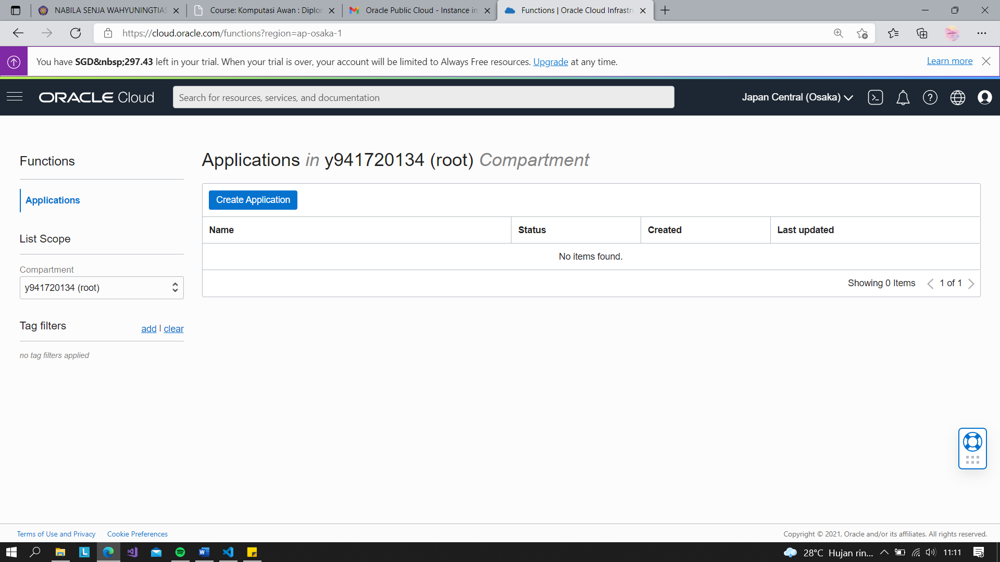
2. Tekan tombol Create Application dan lengkapi informasi form Name dengan hello-app. Lengkapi juga VCN dan subnet yang dibutuhkan. Jika anda belum mempunyai VCN, silahkan membuat terlebih dahulu VCN.
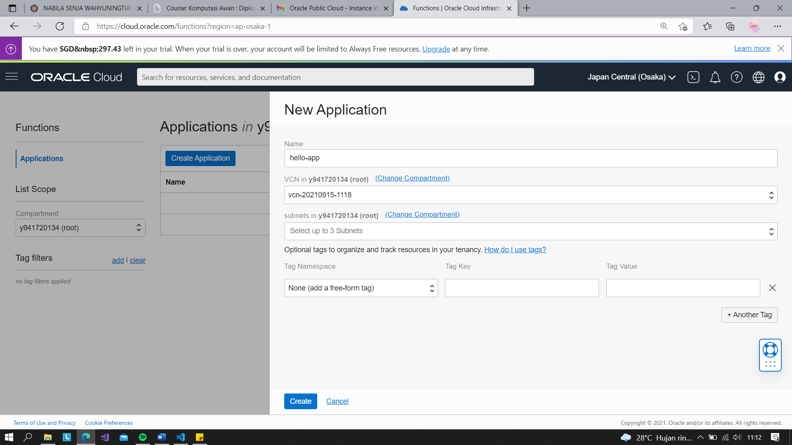 
*VCN sudah tersedia
3. Tekan tombol create dan tunggu sampai muncul halaman Getting Started.
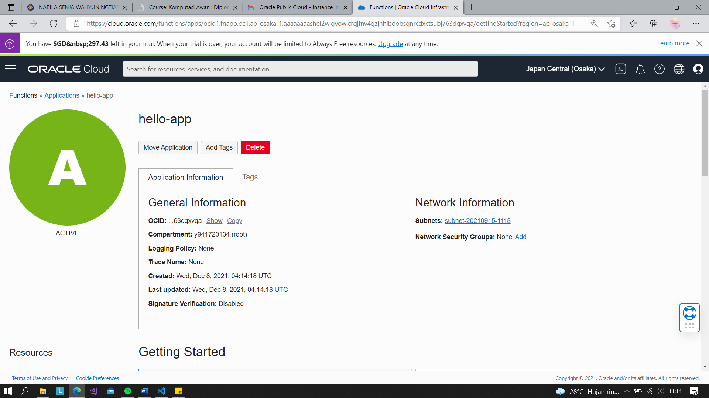 
4. Pada halaman Getting Started terdapat contoh langkah-langkah deploy menggunakan perintah fn. Terdapat dua pilihan deploy, melalui Cloud Shell Setup atau Local Setup.
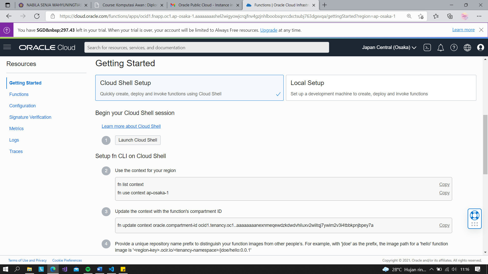 
5. Aktifkan Cloud Shell dengan menekan tombol Launch Cloud Shell. Tunggu proses provisioning cloud shell selesai. Anda akan mendapatkan sebuah terminal built-in yang dapat digunakan untuk melakukan proses deployment
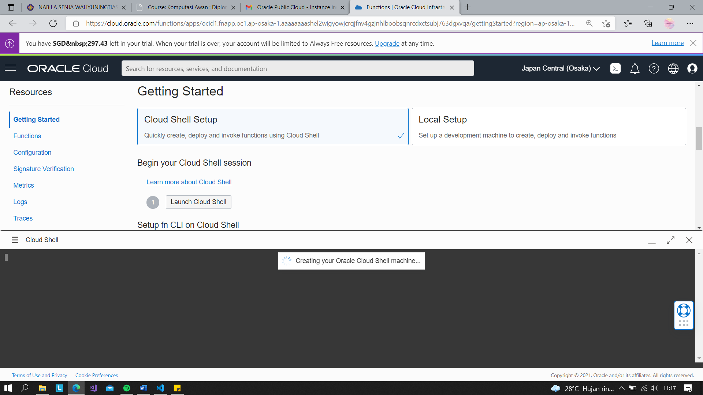 
Tampilan terminal :
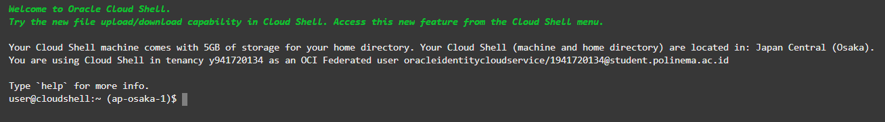 
6. Ikuti langkah-langkah dengan melakukan copy perintah kemudian tempelkan ke dalam terminal Cloud Shell.
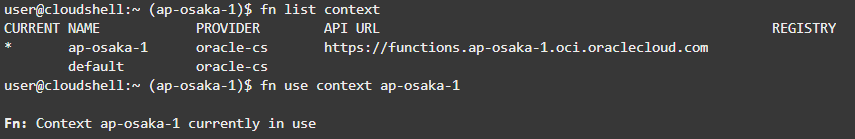 
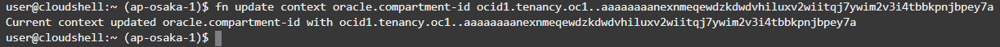 
7. Perhatikan pada langkah ke 4, ubah nilai [repo-name-prefix] menggunakan username / repository name. Sebagai contoh: polinema
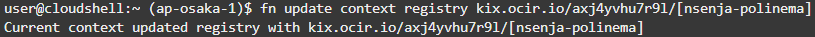 
8.	Pada langkah ke 5, dilakukan proses pembuatan token untuk autentikasi. Tekan tombol Generate Token dan lengkapi form Description dengan nama yang relevan (contoh: faas). Simpan token tersebut.
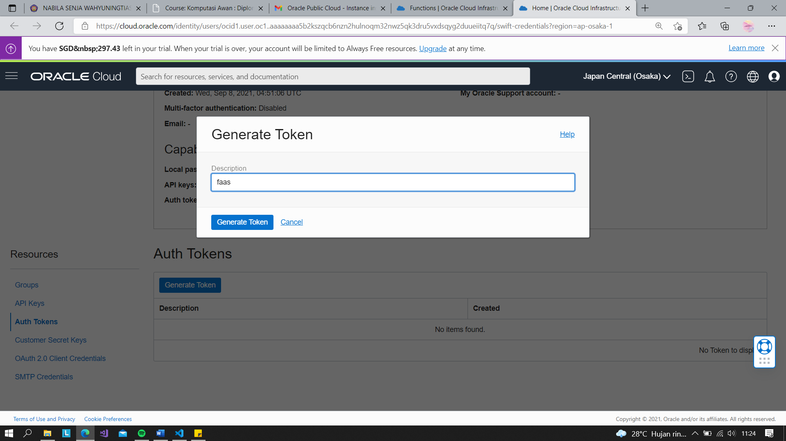 
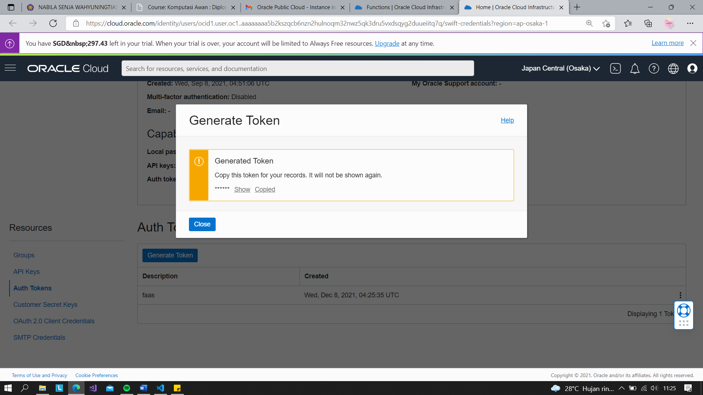 
9. Login menggunakan auth token
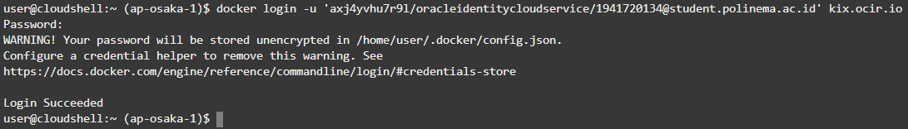 
10. Cek list app
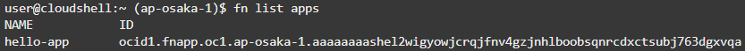 
11. Membuat function hello.java
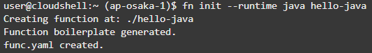 
12. Deploy function error
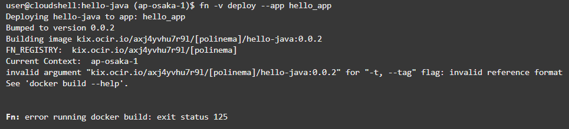 

