# 15 - Autoscalling

Tujuan Pembelajaran
1. Dapat mengetahui Infrasturktur Autoscalling pada Oracle

## Hasil Praktikun
### Praktikun 1 - Membuat Konfigurasi Instance
Kita akan gunakan instance yang telah kita miliki sebagai template untuk konfigurasi instance. Jika belum memiliki instance, buatlah instance komputasi seperti yang telah dilakukan pada pertemuan awal.
1.	Pada halaman detail instance, klik menu More Actions dan pilih Create Instance Configuration.
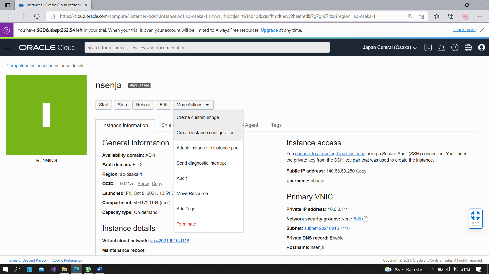
2.	Pilih kompartemen Anda.
3.	Untuk nama, masukkan instance-config.
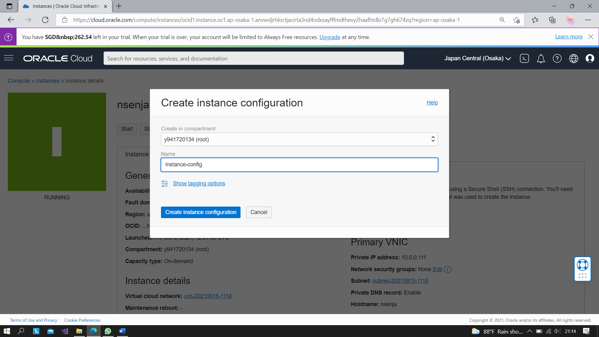
4.	Click Create Instance Configuration.
Setelah Anda membuat konfigurasi instance, halaman detailnya akan ditampilkan, seperti yang ditunjukkan pada gambar berikut.
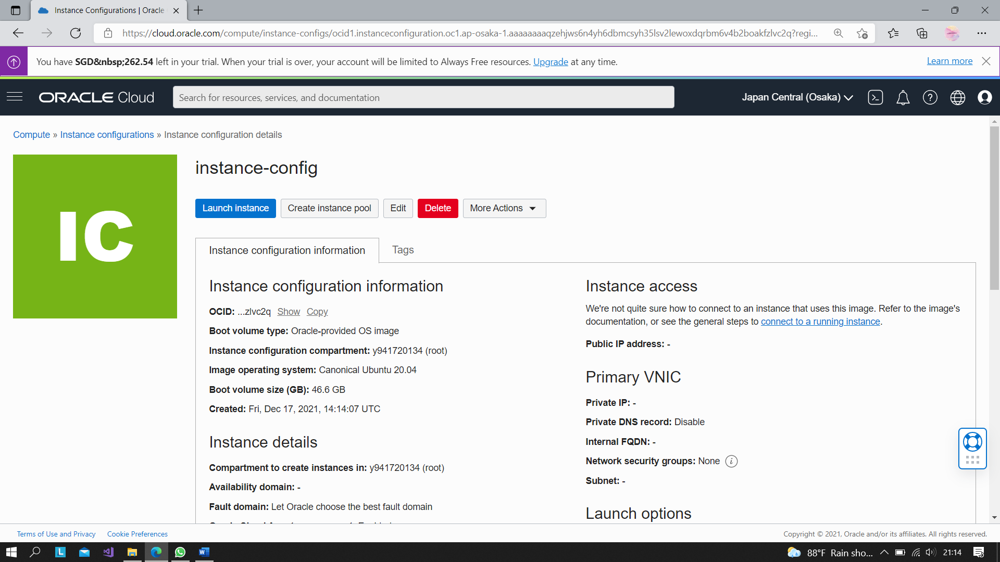

### Praktikum 2 - Membuat instance pool
Anda dapat membuat kolam instans langsung dari halaman konfigurasi instans dengan mengikuti langkah-langkah berikut:
1.	klik Create Instance pool
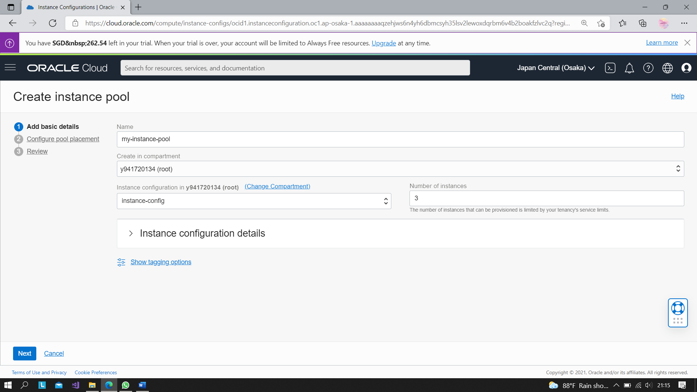
2.	Dari daftar Kompartemen, pilih kompartemen tempat Anda membuat konfigurasi instans.
3.	Untuk nama, masukkan my-instance-pool.
4.	Dari daftar Konfigurasi Instance, pilih instance-config.
5. Untuk melanjutkan, pilih AD1 untuk availability domain, VCN dan subnet. Klik Next  dan kemudian Create untuk membuat kolam instans.
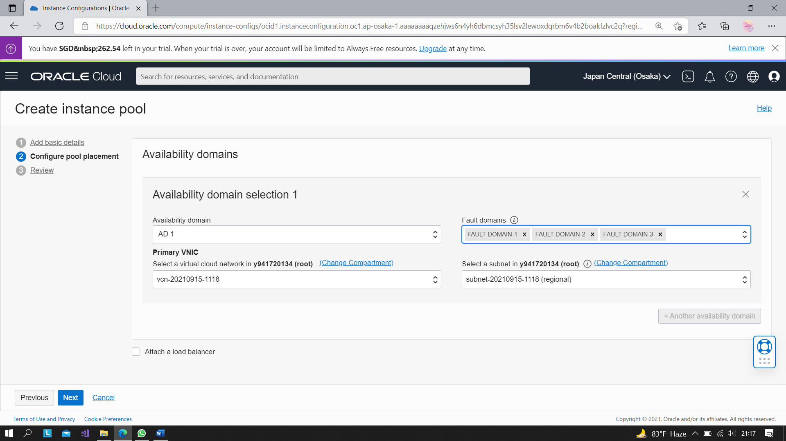
6. Next untuk review
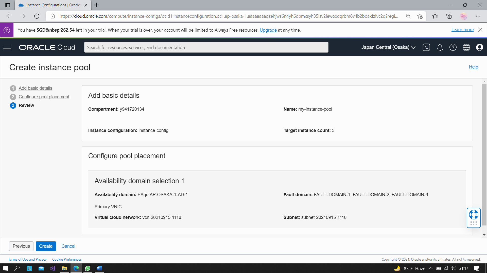
7. Pembuatan instance pool selesai
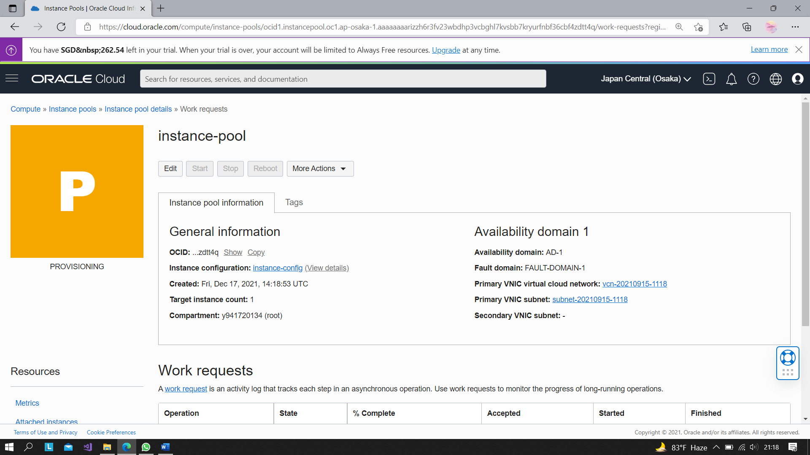
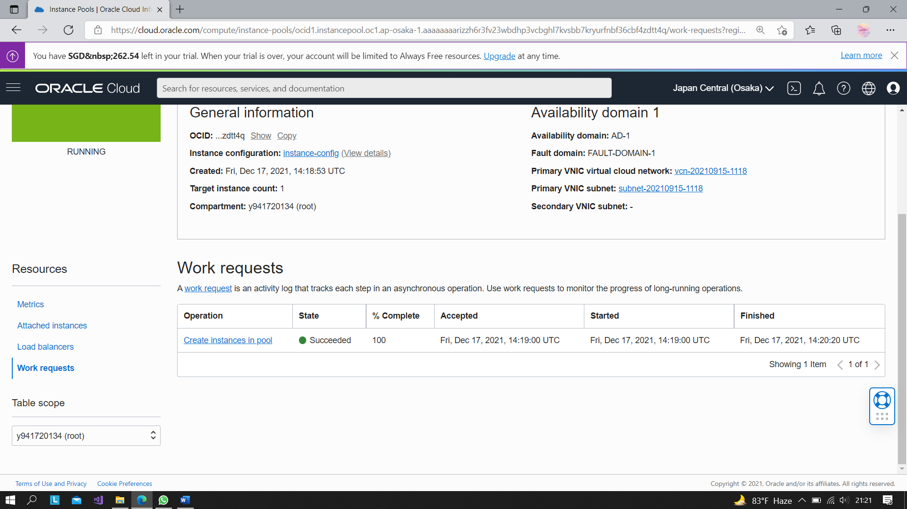

### Praktikum 3 - Membuat konfigurasi Autoscalling
Skenarionya adalah barangkali suatu saat instans yang ada tidak dapat menangani kebutuhan komputasi. Maka dibuat konfigurasi penskalaan otomatis yang secara otomatis menskalakan jumlah instans di kolam instance.
Kita akan buat konfigurasi penskalaan otomatis dari halaman detail instance pool.
1.	Klik menu More Actions dan pilih Create Autoscaling Configuration.
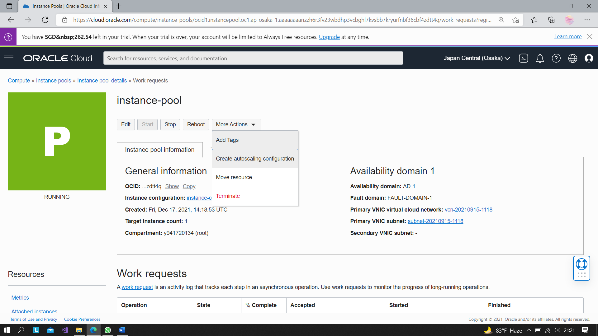
2.	Untuk nama, masukkan my-autoscaling-config.
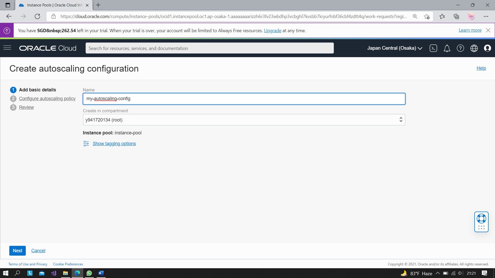
3.	Dari daftar Buat di kompartemen, pilih kompartemen tempat Anda membuat kumpulan instans.
4.	Klik Next.
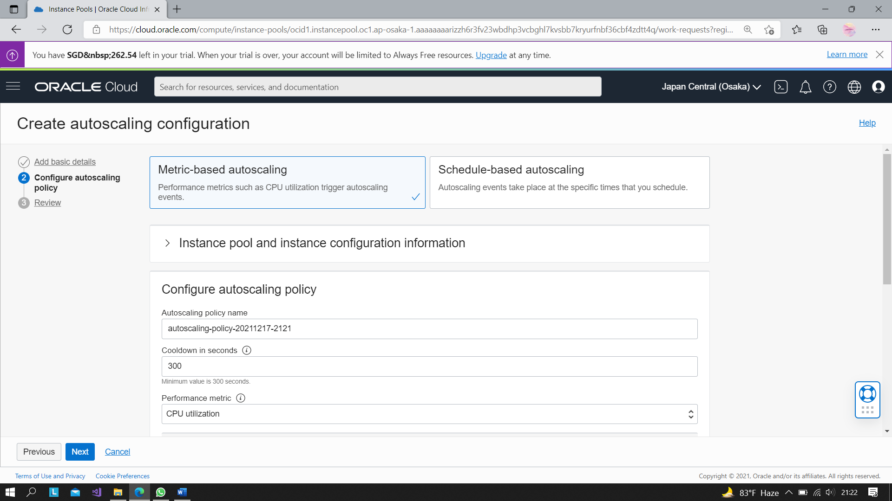
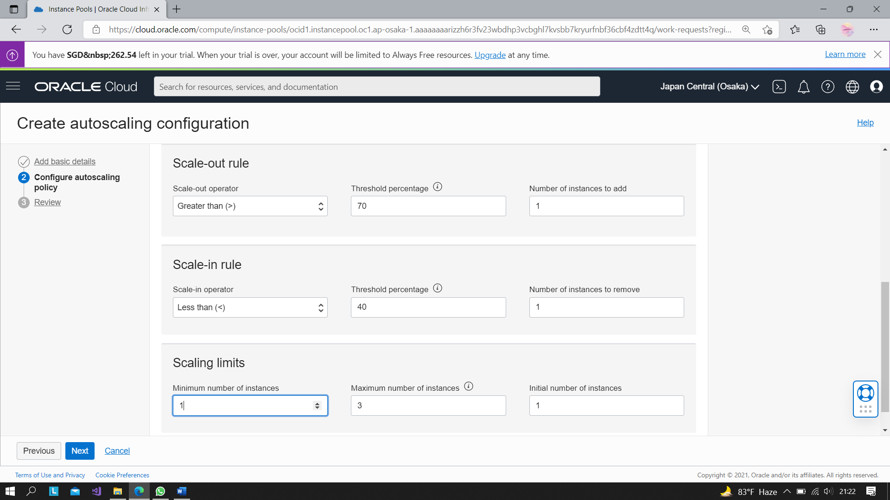
5.	Setelah Anda mengonfigurasi Autoscalling policy, klik Create. Anda dapat menentukan beberapa konfigurasi penskalaan otomatis untuk kumpulan instance yang sama, dan Anda dapat mengaktifkan atau menonaktifkannya salah satunya.
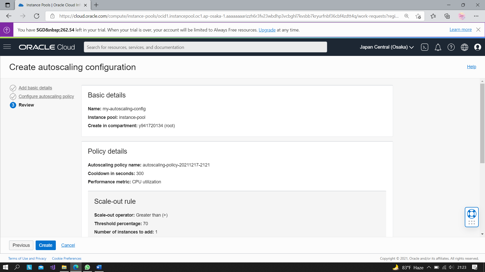
6. Membuat konfigurasi autoscalling selesai
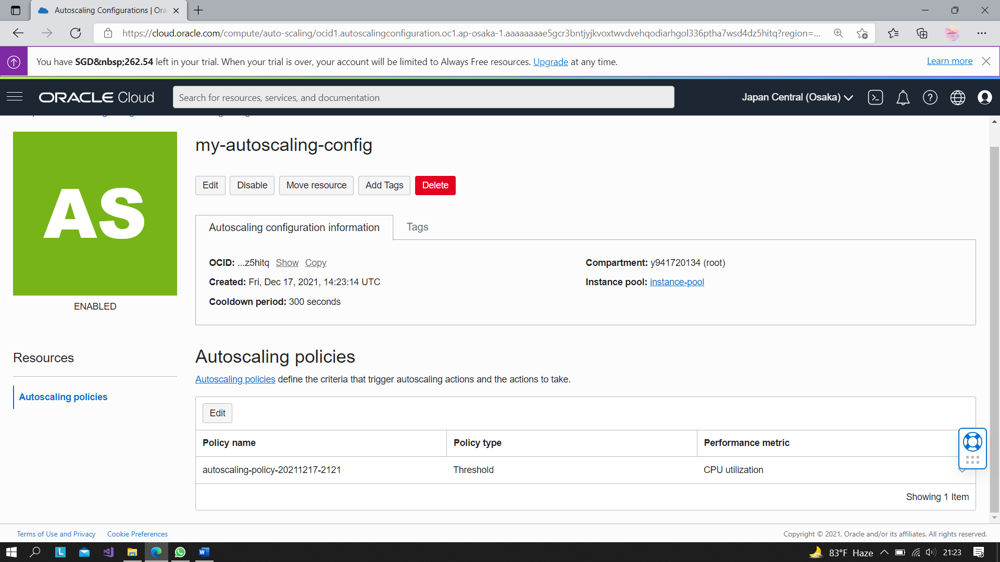

### Tugas
1. Jelaskan Apa kaitan Autoscalling dengan Availability?
### Jawaban :
Auto Scaling membantu untuk menjaga ketersediaan aplikasi dan memungkinkan untuk secara otomatis menambah atau menghapus instans EC2 sesuai dengan ketentuan yang ditetapkan atau jadwalnya dan availability sendiri dapat meyeimbangkan instans di seluruh zona secara otomatis, dan selalu meluncurkan yang baru sehingga instans-instans tersebut seimbang antarzona.